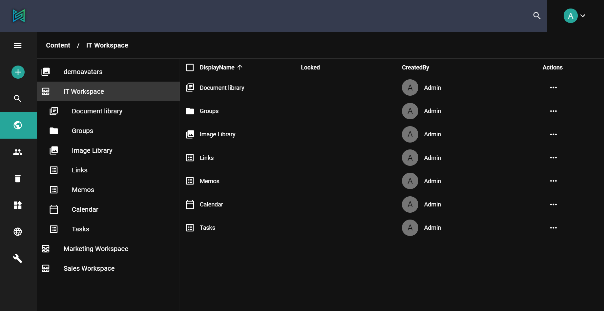

A sensenet content repository is basically a tree structure of the various stored content (e.g. folders, documents, user, tasks, etc.). A specific content is identified by a unique number (ID) as well as its path. The root of the tree is at `/Root` path, and all other content is placed somewhere under this root content - for example, users are placed at `/Root/IMS`.

# Structured storage of content

The tree structure lets you organize and group your content easily by creating separate subtrees. It is not only important because of the possibility to configure content accessibility for different types of users on different parts of the tree, but also because of the inheritance of data like underlying business logic of content types, metadata field configurations and settings.

This kind of data storage makes it possible to store content of multiple different projects (public website, intranet, document management app, etc.) in one repository. By creating multiple subtrees with folders or workspaces, you can build up custom content structures, while every subtree can have its own permission settings, roles, and configurations with regards to who can access it and what it will be used for.

# Searching in subtrees

The sensenet search engine provides you an easy and effective way to query content in the repository. You can make it even more efficient by building separate subtrees for separate use cases. This way the system will only search those parts of the tree that are related, making the search itself much faster and effective. See the related [API references](/api-docs/querying/01-id-path) for examples.

# Content access and URL resolution

As it is mentioned above, every content in the content repository is not only identified by its unique ID but also its path. If you move a content to another folder, thus changing its path, the system keeps track of the changes, making it possible to use the path as a link to the content. For example, the `Path` of the *IT* workspace is /Root/Content/IT, which means it is in the *Content* container: a child of the *Root* folder. This way the workspace is accessible through the /Root/Content/IT URL.

# Permission inheritance

Since content is stored in a huge tree with a single root, when you set a permission on a container item on a higher level (e.g. a document library or a workspace), it will be inherited by all its children. This way you do not have to set permissions on every subfolder or document, because all content inherit permissions from their parent.

Inherited permissions cannot be changed without breaking the inheritance, but you can set additional permissions for the same identity (e.g. grant `Open` permission to someone who already has inherited `See` permissions).

Setting local only permissions that are not propagated to children is also possible within sensenet. Check the [document level permission article](/concepts/document-level-permissions) for more information.

# Settings inheritance

Settings are created for administrators or editors to let them customize the behavior of a certain feature. In sensenet, these settings are stored as content in the content repository, allowing you to take advantage of the tree structure in the case of settings as well.

Settings files can be global or local. Local settings files override global ones and are applied only on the related part of the content repository. Every key in a settings file can be overridden in another file with the same name under an appropriate position in the subtree. For example, you can use a global document preview watermark setting for the whole repository: one for a project workspace and another one for a specific document library for contracts.

# Content type inheritance

Content types are defined in a type hierarchy: a content type may be inherited from another type, automatically inheriting its fields and the underlying business logic (handler). A content type may only inherit fields from a single type because of the tree structure. Multiple inheritance is not allowed. Inherited field configuration can be overridden in derived types. For example, a custom `CompanyUser` type inherited from the built-in User type will have all the fields that are defined on the `User`, and can also have additional ones related to its specialties.
