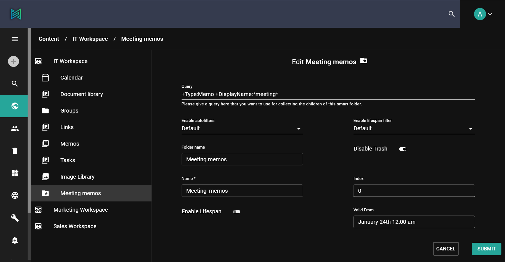
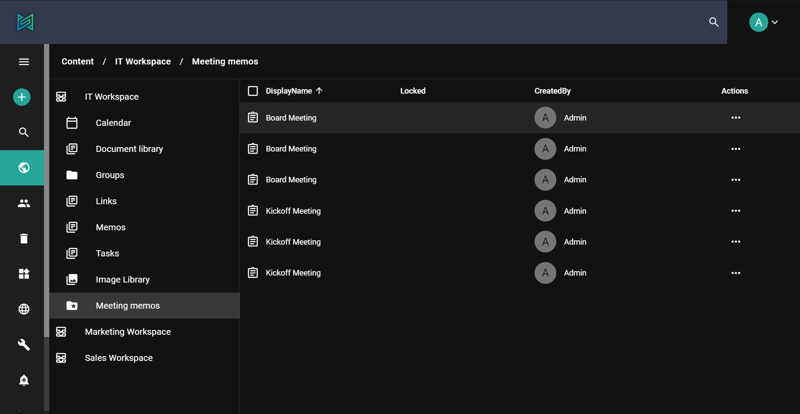

One of the main features of sensenet is Content Query. Since the repository is a **query-based system**, it means that every content is delivered by a sophisticated and fast query engine.

As a user, a developer or a repository administrator you get a simple but powerful content query language (CQL). You can use this language to find, filter, and sort content even in a huge and constantly expanding repository. As a developer, you get an easy-to-use API as well, capable of serving any need in your custom code.

# Indexing

For every [content](/concepts/content-management), the field values can be indexed so that when you search for a term, the corresponding content with the related field value will appear in the result set. It is also possible to search by explicitly defining the field whose value you want to search for. The way a specific field of a content is indexed is defined in the CTD Field Definition.

[More about indexing](/concepts/basics/04-search#metadataindexing,searchingbyfields)

# Basic search

In most cases, you want to look for a single term or a phrase, which is a group of words surrounded by double quotes ("apple pie"). In these cases, sensenet will look for contents that have these words in their default index data, which means it contains all the relevant text of the content.

In more complex situations, you may need some filtering based on the type or place of the content you are looking for. You may also want to search in a specific field. In this page, you can learn how to construct more complex queries that you can use to effectively find content even in a huge repository.

[Check the API docs for complex queries and examples](/api-docs/querying)

# Security

In sensenet, there are many contents that we consider security critical such as users, confidential documents or system content. As this platform is based on Content Query that lets users find content in the repository easily, we need to make sure that no one can access information that they do not have permissions for.

When a user executes a query, the result list will contain only the content that the user has permissions for. There is no way for the user to access other content using a query, only the permitted ones. This is baked into the system, because we filter the results based on appropriate permissions. This means that even if somebody hijacked the query somehow, they will not be able to access sensitive information.

The most sensitive personal data is the password of a user. To make sure that it is safe, sensenet does not index the *Password* and *PasswordHash* fields - and this cannot be changed by any configuration. This behavior is hardcoded.

# Smartfolder

**SmartFolder** is a very powerful feature of sensenet. You can define a query to collect content from anywhere in the repository and present them as children of a SmartFolder. Smartfolder is a special type of content in the repository with a specific field to contain a query.

After saving a Smartfolder with a query it will group the results as its virtual children (the actual contents remain at their original location). This way you can create virtual group of content that match your requirements and you can work with them at the same time and place even if they are far far away from each other in separate workspaces, libraries or folders.

