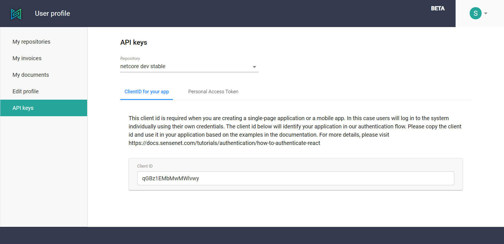

**sensenet as a Service** lets developers build rich and secure applications that are able to handle many  different user scenarios and manage a wide range of content types. To make that possible, we use a security architecture that provides developers with a simple but powerful authentication workflow. To learn more about the way authentication works in sensenet, see the [authentication concepts](/concepts/basics/06-authentication).

In this article we provide the technical details about the items you'll need to connect to a  sensenet repository: client ids and secrets.

<note severity="info">These values are specific to a content repository. If you are working with multiple repositories, you will need to use the client ids and secrets dedicated to each.</note>

To access these values, please visit the **API keys** section of [your profile](https://profile.sensenet.com/?redirectToLogin).

## Client id types
A client id represents a type of client that connects to a sensenet repository. Every repository has two client ids: one for individual users and one for tools.

### Client id for your application
If you are creating an application that will let **individual users sign in**, than this is what you need. In this case you do not need a secret, because users will log in using their own credentials. Just add this **client id** in your configuration and use our APIs to connect to sensenet.

<note severity="info">Client APIs may also require an <b>authority URL</b>. This is a url of the authentication server you get for your repository. To find that url, please visit the details page of your repository on <a href="https://profile.sensenet.com/?redirectToLogin" target="_blank">your profile</a>.</note>

For details, please visit this article:

- [Authentication from a React application](/tutorials/authentication/how-to-authenticate-react)

### Personal Access Token
If you are creating a tool (a system application that connects to a repository) or need to make server-to-server calls from another application, you will need a **client id** and also a **secret**.

In this case the client id represents a particular system user in your repository. When using this client id, you will make requests **in the name of this user** - which is the default administrator user of your repository.

The secret is a kind of a password for this client id. Please make sure **you do NOT share this secret** with anybody and keep it hidden.

For details, please visit this article:

- [Authentication from a .Net client](/tutorials/authentication/how-to-authenticate-dotnet)

## Regenerating secrets
In case you think that your secret has been compromised, you have the option to generate a new one. This will render the previous secret invalid immediately and you need to update this value in every tool that uses this secret to connect to the repository.

To generate a new secret, just press the regenerate button next to the secret and copy the new value.

It is not possible to regenerate client ids, only secrets.
