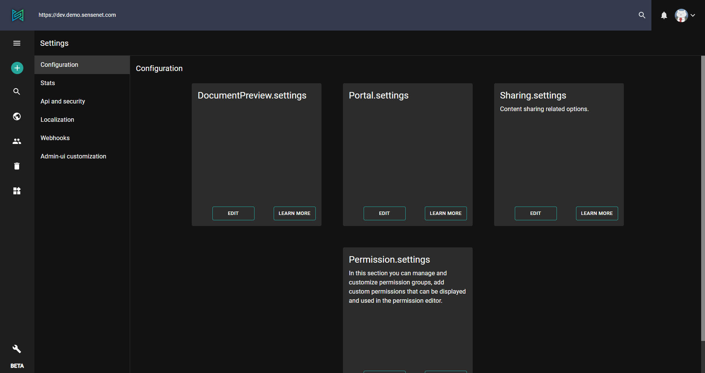

**sensenet** has a number of modules and features that provide a way to customize their behavior by offering settings. It is an essential part of any application: how it stores and handles settings. Keeping this in mind, we wanted to provide a framework that is easy to use and customize, enabling developers to make custom modules that are more flexible and easier to configure.

To access the settings page, click the settings icon in the lower left corner of the admin surface. This will open the Setup page, where you can manage global settings.

> [How to change global settings on admin UI](/guides/settings/setup)

# Settings is a content
In sensenet, settings are stored as content in the content repository. The advantage of this is that changing a setting does not involve site restart, and values can be managed in one central place.

Another advantage of storing settings as content is that you are able to provide a rich UI for administrators to manage them. Settings are actually JSON files, so it is easy to build a dedicated UI for creating or editing settings in your app, or simply updating them using OData.

# Local and global settings
Settings in sensenet can be either global or local. All settings files have a `.settings` extension.

**Global settings:** stored in the `/Root/System/Settings` folder or can be found on the Setup page of the admin UI (see the settings icon in the lower left corner on the image above).

**Local settings:** any folder can contain a system folder named Settings for storing settings files related only to those parts of the repository that override or extend global settings.

> Currently _editing_ local settings is only possible if the local content is under a workspace.

# Setting inheritance
Settings files can be global or local. Local settings files override global ones and they are applied only within that part of the Content Repository.

Every key in a settings file can be overridden in another settings file with the _same name_ on a _lower level_ in the subtree.
In this case, the real settings of your application are combined by the ancestor settings chain.

The inheritance is realized on the file and key level: if the settings file on a lower level (which has the same name) contains only one key, only this value will be overridden; values in other files in higher levels will not be affected and remain accessible.

## Under the hood
To achieve this, the system uses a path parameter. That is the content path that the settings framework will use as the starting point when discovering the appropriate settings. If no local setting is found with that name or given property, the fallback is always the global settings file in the `/Root/System/Settings` folder.

## Usage
The variety of settings enables a multitude of use cases. Let's have watermark settings as an example. In sensenet, it is possible to set a watermark globally for each and every preview image. In addition to that, you can define different watermarks for different workspaces (which will then overwrite global settings), or even set watermark to a specific document library.
Watermark is just one example of how versatile settings in sensenet can be, mainly due to the [hierarchical tree structure](/concepts/basics/02-content-tree), which forms the base of our content repository.

# Editing settings through OData
Settings content can be edited through OData. There is a dedicated API for writing local settings, or you can simply use the regular content API to upload or edit settings files.

> [How to edit settings through OData](/api-docs/settings)
