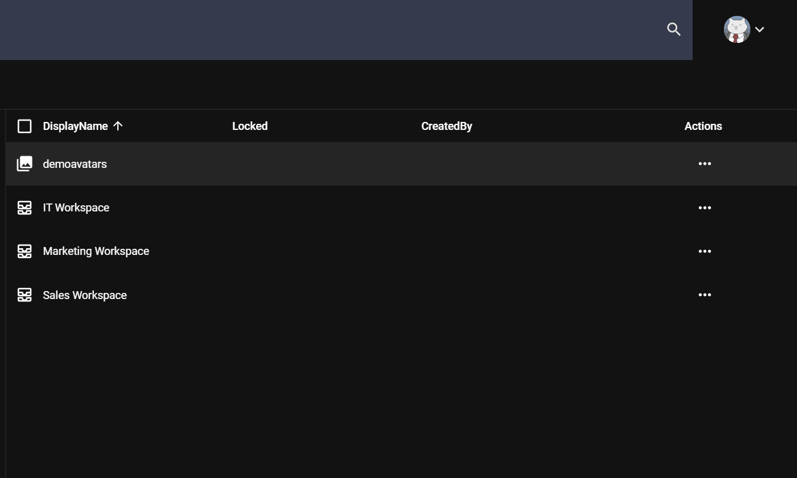

Most of the operations with content in sensenet is governed via Actions. An Action is basically a command, instructing the system to use a specific component, to get or update the properties of the addressed content item. All of these actions can be invoked through OData REST API. There are many built-in actions in sensenet, and developers can publish custom operations as actions as well.

Under the hood, OData operations are integrated into sensenet via the *Action Framework*. **sensenet** actions behave as OData operations. The action in Action Framework is the extensibility point: every 3rd party action appears automatically in OData metadata if the current user has enough permissions.



# Built-in actions

There are tons of built-in actions (operations) in sensenet. There are actions related to versioning, permissions, and user management. Use cases can be very different, but the way they are used is the same. They can be invoked on a content, have a unique name, and can have optional and required parameters. An action call looks like the one presented in the following example:

```
https://myproject.com/OData.svc/Content('MyContent')/ActionName
```

As their use is quite unique in each case, for specific use cases and examples check the [API docs](/api-docs/basic-concepts/09-actions).

# Exploring actions of a content

Actions are always connected to content. As such, you can look at them from the side of the content as well. That means you can always check which actions are available for a content without doing any special moves or writing custom code. List of the available actions are stored on the content metadata, or can be requested with a custom action called */Actions*.

[More about exploring actions](/api-docs/basic-concepts/09-actions#exploringactions)

# Accessibility

Actions can be contents in the repository, too. And as it is the case with every other content, sensenet actions are also covered by the permission system. Which means you are not only able to set permissions on a content or for a subtree, but you can even control the access of those actions. This way you are able to define which user types can do a task and which ones cannot (e.g. you can allow the *Editors* group to use the **Approve** action but not allow it for *Developers*). There is a separate permission for dealing with accessibility. Its name is RunApplication, and by allowing it on an action content for a user, you give them permissions to execute the operation.

It is also possible to add custom rules to an action in case the user has a special permission for using the affected action. For example, you need the user to have a permission for both deleting *and* approving content. Every action has a field, called *RequiredPermissions*, that lets you add as many required permissions as you need.

# Custom action groups and lists

Another advantage of storing actions as content in the repository is that you can create loosely connected groups of them. That means you can create custom menus dynamically just by using the *Scenario* feature of sensenet. *Scenario* is actually a field on every action content where you can add custom Scenario names freely. This name will be the name of your group (e.g. UserMenu), and you can refer to it later when you request */Actions* on a content in the following way, for example:

```
https://myproject.com/OData.svc/Content('MyContent')/Actions?scenario=UserMenu
```

This way only those actions will be listed in the results that have the name *UserMenu* set as the Scenario.

[See more scenario examples](/api-docs/basic-concepts/09-actions#scenario)
