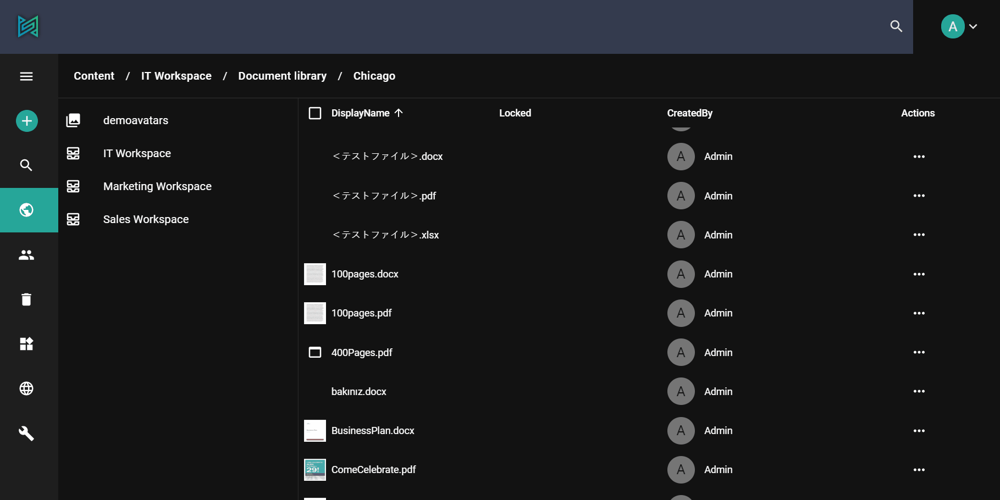

sensenet enables collaborative content management, thanks to [Office Online editing](/concepts/collaboration/03-office-online-editing) among others.

Being able to collaborate on the same document contemporary saves you time of emailing files, store them, and also prevents you from having to reconcile multiple versions of the same document.

# How does it work
There is no special co-authoring mode and no command to begin co-authoring. You can edit the file as you normally do, and if others are also editing the document, Office will alert you of their presence. You can open the document (word, excel files) right in the browser and the service will save the changes automatically.

# Versioning
Versioning, also known as revision control, is the management of changes to documents and other information stored in a file system or repository.

The main goal of versioning is to prevent information from being overwritten or deleted during everyday work with documents. Changes are kept track of, and a mechanism is offered to restore a particular document to a previous version.
The versioning system of sensenet also provides mechanisms for keeping the last published version of a document visible to non-editor users, while you continue to work on the new, draft version. In sensenet, versioning is disabled by default but can be switched on or off on every subtree or even on individual documents.

# Permissions
Managing and editing documents is strictly related to permissions as well. It is not necessary (or not even allowed) that everybody has access to all the information, all the content.
sensenet enables you to set permissions [role based](/concepts/user-and-permission-management/03-role-based-permissions) or on [document level](/concepts/user-and-permission-management/02-document-level-permissions).
There is a set of basic built-in permissions, such as See, Open, Save, Delete etc., and it is even possible to add [custom ones](/concepts/user-and-permission-management/04-custom-roles-and-permissions). It is possible to manage them through the admin surface or with the [User Management and Permission APIs](/api-docs/users-and-groups).

# Under the hood
To be able to configure this feature on the admin ui you need to have Office Online server and client side subscription. If you have your Office Online server installed and ready, the only thing you have to do is to set its url as the `OfficeOnlineUrl` in the Office Online setting on the Setup page of the admin ui.
