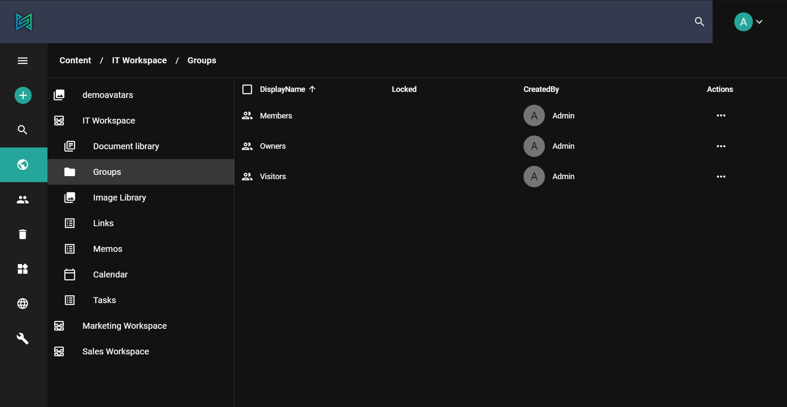

sensenet allows individuals or a teams in an organization to easily create and manage their own collaborative spaces, called workspaces. A sensenet workspace is a special content type with libraries, lists and many other features configured for a predefined goal. Workspaces may contain sub-workspaces, and further sub-workspaces as well, enabling you to create the best solution based on your business needs.

# Where to start?
You can create a new workspace from built-in workspace types (Sales workspace, Document workspace, Project workspace, etc.), create one from scratch, or create a new template others can use. Every workspace has its own navigation, members (custom permissions, custom user groups/roles) and many other settings that are related only to the given workspace.

# Application (when to use?)
We can distinguish two different types of workspaces:

**collaborative workspaces** - where team members can work together on the same content and share info with each other.
- share and store content relevant to the whole team
- limit access to workspace and its content
- collaborate on multiple level (info sharing, office online editing etc.)

**workspace as a logical unit** - used to formulate a separate area in the final solution (like subsites)

You can have different workspaces completely separated (with workspace level user groups and trash), giving the opportunity to manage multiple company with different users on the same solution as an example.

# Workspace local groups
In sensenet the default location of users and groups is the ``IMS folder``. However groups can be created under workspaces too. The main purpose of workspace local groups is to help permission management inside workspaces. They are located under the ``Groups`` system folder in workspaces, and workspace permissions can be defined for these groups.

> If the local group structure is properly configured, the only thing workspace administrators should do when a new user is assigned to a workspace is to add them to the proper local group(s) instead of assigning permissions to individual users.

In sensenet there are three predefined local groups with three different permission levels covering the most important use cases but there are no limitations to add or remove groups or modify the default behavior.
- **Owners** have full control over their workspaces, only they have the right to set permissions, manage local groups, or modify the configuration of lists and workspaces. They are like local administrators.
- **Members** are the typical users of a workspace: they can create, modify, publish content, but they can not approve them, or modify the top level settings of workspaces.
- **Visitors** have only open permissions.

Groups are contents too (like almost everything in sensenet), so you can add additional groups to workspaces as easily as you add folders. Populating a group with users can be done using user management on the admin ui or through OData REST API.

You can use local groups when you are building up workspace templates as well. With this technique you can provide ready-made workspaces for your users.

It is also possible to add local groups as members to global groups. This way you can easily extend the rights of global groups - for example built-in groups.

# Types
In a system built on sensenet there can be many different types of workspaces. It is typical to create new workspace templates for a new sensenet installation since the business needs are different for every organization.

For demo purposes, you can use the following built-in workspace types:
- Document workspace - to collaborate mainly on documents,
- Project workspace - a demo workspace for typical collaborative projects (with tasklists and so on)
- Sales workspace - a demo for a sales process with built-in KPIs,
- Empty workspace - if you want to start from scratch

> In sensenet the workspace content itself can be tailor made. You can freely add, modify or remove fields on every workspace type.

# Workspace level options
In every workspace you can:
- define the list, libraries and other content types users can create in the workspace
- turn on/off version history for any content in the workspace,
- turn on/off approval for any content in the workspace

# Usage
Workspace is a good solution when you want to create separate units (subsites, teams, companies, user profiles) inside your solution. It is important to define custom workspace type and set permissions properly right at the beginning of the project. This way you can facilitate your work on the long run.
