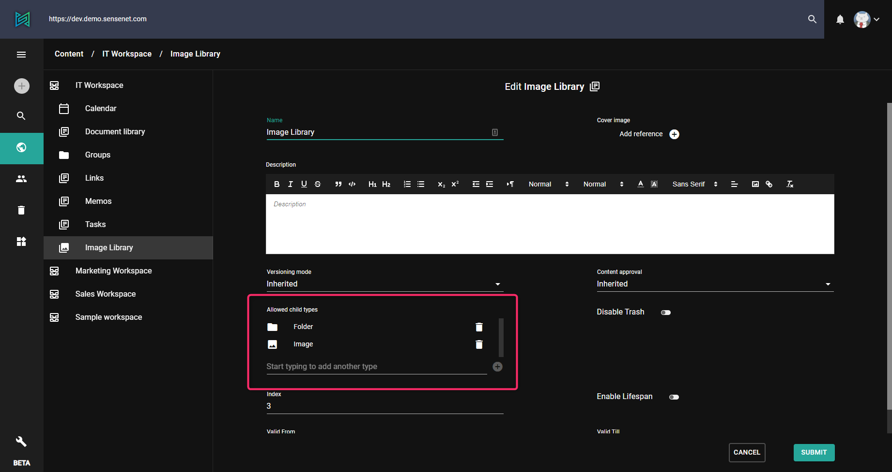

sensenet content repository stores different content types. One of the major differences between a file system and the content repository, is that in a file system you can store any type (file or folder) anywhere, whereas in the sensenet content repository it is possible to define restrictions on what content types the different containers can contain. This allows you to create a much more precisely defined content structure and provides control on the long run.

# What it's used for?
You can configure ``allowed child types`` in the content type definition of the different types. For example a Calendar can only contain Events, a Document Library can only contain Folders and Files, etc. These settings can be overridden on the specific content, for example you can modify any of your document libraries to contain images too. There are also some special types that behave differently: a Folder for example can never define child types, it will always inherit its parent settings. A SystemFolder will allow every type by default and can be created anywhere in the repository.

# CTD settings

To set the default allowed child types for a specific content type, go to its ([CTD](/concepts/content-management/03-content-types#contenttypedefinitions)) (or content type definition) and define the ``AllowedChildTypes`` element. If it does not exist yet, create it right before the Fields element:

```xml
<AllowedChildTypes>
Folder,File
</AllowedChildTypes>
```

The above settings will ensure that whenever you create a new content of this specific type, only Files and Folders will be allowed to be created under it. This setting can be overridden on the created content as explained in the next section.

# Content settings

Allowed child types can also be defined on content instances. When types are locally defined for a specific content it overwrites the CTD settings of its type. This way you can freely modify allowed child type settings for a specific content, and modifications in CTD will not affect the child type settings of that content in any ways. The local allowed child type settings of a content is stored in the ``AllowedChildTypes`` field.

Allowed child types of a content can be modified on the admin ui or through API as well.



By default it shows the allowed types according to the CTD settings. You can remove any enlisted type and also add new allowed types using the dropdown under the list.

> You cannot remove all of the specified types. If you do this and save the content, settings will automatically be inherited from the CTD.

## Explicit and effective allowed child types

The AllowedChildTypes field itself does not always store the values you see in the user interface. For example Folders and Pages cannot have their own setting (see below), they always inherit from their parent. Other containers may inherit their allowed child types list from their content type (CTD). 

> If you as a developer need the actual list of types that your users will be able to create in a container, use the ``EffectiveAllowedChildTypes`` read only field based on the read only property with the same name.

# Creating new content
The allowed child types definition on a content (whether it comes from CTD or from local settings) influences the Add new action, resulting that only allowed types appear in the list.


> A content type in the add new menu will only show up if the user has see permissions on the specific content type node.

# Content allowing all types
It might happen that a certain content does not impose a restriction on allowed types. In this case any type is allowed to be created under that content. Since this however imposes a security risk as executable types can also be created at these locations, creating a content of any type under such locations is only allowed for users of specified groups. 

```
```
If the user is not a member of any enlisted group he/she will not be able to create anything under locations where allowed child types list is empty.

# Inheriting types
A **Folder** always inherits these settings from its parent content. You cannot set the allowed child types property of any specific Folder item nor in the CTD (this restriction is valid both for admin ui and API as well). Therefore whatever allowed child types settings you specify for a list containing a Folder, these settings will also apply for the children of the Folder placed in this list. This ensures that if you build structures in a content list using folders, your list settings will never be overridden on a lower level.

# Special (or technical) type
A **SystemFolder** can be created anywhere in the content repository, regardless of its parent content’s allowed child types settings, if the user is granted to see permissions on the SystemFolder content type. This ensures that developers can create SystemFolders without having to modify the allowed child types of the individual content. Also, a SystemFolder does not specify any allowed types by default, so all types are allowed under a new SystemFolder. Allowed types however can be configured for a SystemFolder instance. 
SystemFolder is used mainly for storing settings or other technical contents.
