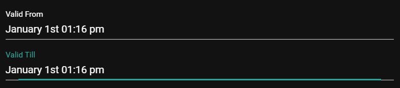

Lifespan management is a feature which allows arbitrary content items in a sensenet repository to be shown only in a pre-defined period of time. These content items can appear at a specified date and can disappear at another specified date. It is also possible to make a content item appear at a given time and have it stay there indefinitely or to make it disappear at a specified time.

Lifespan management in sensenet is intended to be both user-friendly and performant. This means that lifespan management can be enabled individually for any content and can be enabled for queries, but is by default disabled.

The feature needs to be enabled on the content type for which lifespan management is desired by allowing the necessary fields to be shown on the user interface. If this is done, users who create items of that content (on the admin-ui or through REST API) can enable it on content items individually by filling the related fields.

In order for lifespan management to be taken into account (e.g. display items only in a specified interval), it needs to be explicitly enabled on the related queries to support it (by default it is disabled).

# When to use it?

Content scheduling comes handy when you have to display only timely contents, for example a timed blog post, article or an important company rule that should be only available and considered for a specific period of time. Lets take blog posts for example and check the steps should be made in order to enable content scheduling.

# Using lifespan management

To enable lifespan on a content item (for example a blog post), do the following:
- Set the value *EnableLifespan* field to true. This means you need to check the checkbox that enables it on the ui or set its value to true through REST API.
- The *ValidFrom* field tells when the content item will appear. If it's left blank, it will appear immediately.
- The *ValidTill* field tells when the content item will disappear. If it's left blank, it will never disappear.

All of these fields are defined on the `GenericContent` content type so they are inherited to all other content types both built-in and custom ones.

To enable lifespan in a query:
- add `.LIFESPAN:ON` to the query. See [this page](/api-docs/querying/04-date#querybylifespanvalidity) for an example.
- or use `enablelifespanfilter=true` in an OData request url. See [this page](/api-docs/basic-concepts/08-lifespan) for an example.

So this means you have use the lifespan filter in your view or custom component displaying blog posts in this case.
