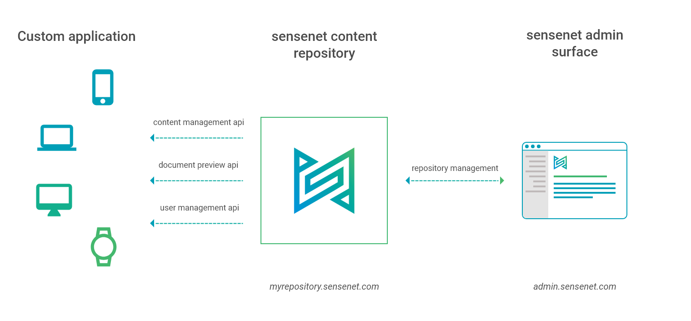

In this model sensenet content repositories lives on our cloud infrastructure.

For a monthly subscription fee all your content and data are stored securely by us saving you from all maintenance related tasks and installation, ensuring easy onboarding, easy updates and patches.

A basic setup of sensenet has three top level parts:
- a **content repository** that is the storage and service layer,
- an **application** that uses the content of the connected content repository through API calls and 
- sensenet **admin surface** that helps you do common content managements tasks or setup and keep your system up to date.

# Advantages

- no installation required (means easy onboarding)
- easy patches and upgrades
- no hosting related tasks
- central admin surface
- flexible pricing plans (based on # of content, request, user)

# sensenet cloud

- our infrastructure
- secure and everything
- hosted in europe
- future plans make it possible to choose between multiple cloud services

Are you interested in having your own repository in the sensenet cloud? [Contact us](https://sensenet.com/contact#earlyadopter), be an early adopter and get a repository free for a try-out.
