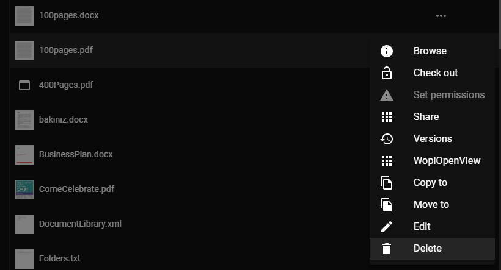
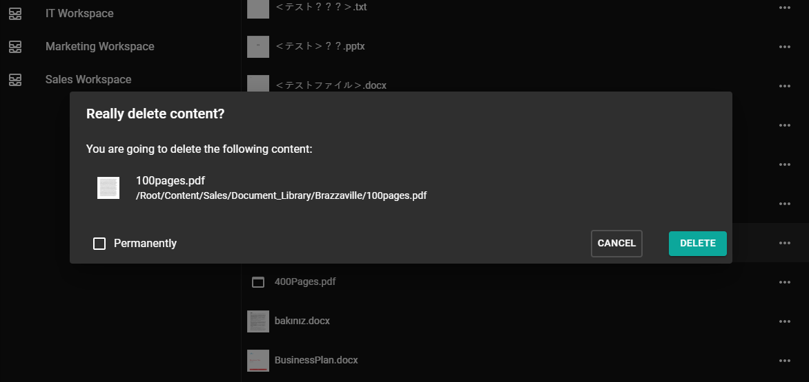
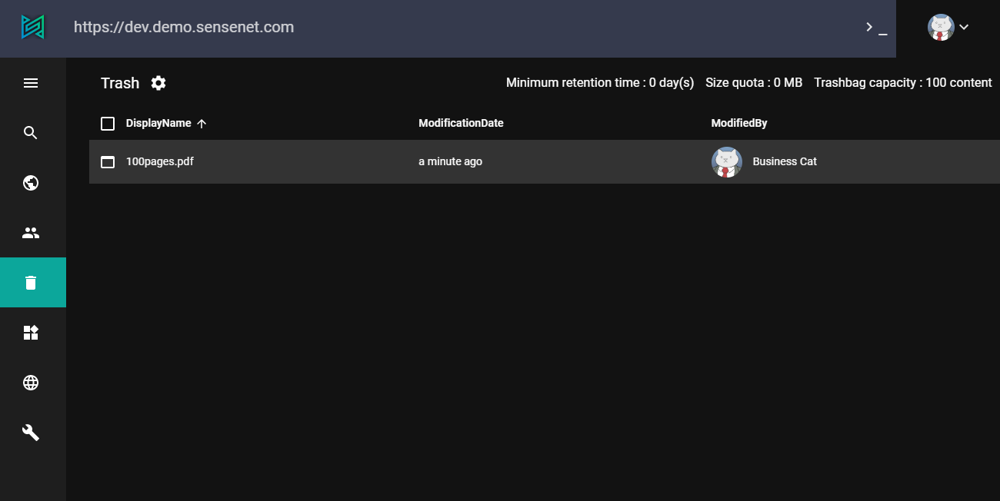
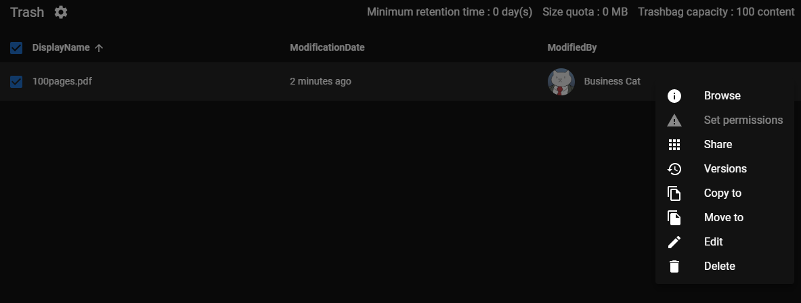
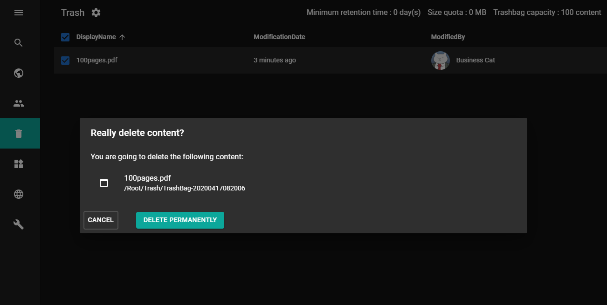

# introduction
sensenet has a trash feature. When you delete a document or a folder, and the trash feature is enabled (enabled by default), the content will be wrapped into a special container called the Trash Bag, and will be moved to the Trash Bin (/Root/Trash). 

The Trash Bin is a central place for deleted documents where you can browse, restore or delete content permanently. It is also possible to provide a local (workspace-level) trash for users.

The size of the trash and the time frame while the contents can be recovered from the trash is set by the administrator. Trash feature can be switched on or off globally.

# Delete operation capabilities
Delete operation allows users to transfer content (documents, folders or whole workspaces) into the Trash Bin - or delete them permanently.

Contents can be deleted through API calls, but these actions are also available on the admin ui:

You can access delete action for basically every content in the doclib by clicking context menu (...) or right click on item.



By default configuration, a confirmation popup appears, displaying content name and path, with an additional option to permanently delete the content (skipping trash). 


Deleted (trashed) items can be found in a specific folder having some extra parameter like retention time, quota for size and number of content. These limits can be customized.


Content from trash could be restored to a container chosen by the user. By default this container is the original parent of the deleted content, but the restore target could be chosen freely,

**important:**  type of the restored content should be allowed on the chosen container.

Additional actions can also be performed on trashed items like edit or delete permanently.


When deleting a trashed item, the content will be permanently deleted


If the trash is disabled, the popup informs you that the feature is turned off. Be careful because you may delete a content permanently. Your content can't be restored in this case.


# workspace trash

It is possible to provide a workspace-level trash for users. Deleted content in fact will still be moved to the global Trash (/Root/Trash) but users will be able to see content deleted from a particular workspace in a folder under that workspace. This functionality is practically a filter for the global Trash and can be accessed by creating a SmartFolder under the workspace. You can place the SmartFolder anywhere under the workspace.

Properties of the SmartFolder:
- Folder name: anything - e.g. Workspace Trash
- Autofilters: disable
- Query: +InTree:'/Root/Trash' +TypeIs:TrashBag +WorkspaceId:@@CurrentWorkspace.Id@@

All content deleted under the workspace will be visible here and can be restored or deleted permanently. The deleted content are still accessible and restorable from the global Trash and all size and date settings are still applied.

# trash bin options
Trash Bin options can be edited through API. 

### Enable/disable the trash feature globally

If the trash is enabled in the system, deleted content can be moved to the Trash Bin. You can find them on the path /Root/Trash.
If you disable the trash, previously deleted content won't disappear, you or the owner can restore them freely. Content deleted with disabled trash will be removed permanently from the database.

### Set the retention time of deleted contents

The value set here is the days the content should stay in the trash before deleting it permanently. If the value is greater than 0, users (or any automatism) cannot remove the content from the trash before the expiration date. Changing this value does not effect previously deleted content.

### Set the size of the Trash Bin

The size quota is the amount of content in megabytes that can be stored in the trash. This value is only a UI hint, it does not effect deleting content. If the size is exceeded the Trash Bin main page will display a message about how much space is used. The administrator should take care of purging content from the trash manually.

### Set Trash Bag capacity

If you provide a number greater than 0 as the Trash Bag capacity, only containers having a smaller number of children can be moved to the trash at the same time. This setting effects only one delete operation. In case this setting prevents you to delete a big subtree you can still delete those content one-by-one.

### Enable/disable the trash feature on a container

You can enable or disable the trash feature on almost any container content. By default, the feature is enabled and deleted content go to the trash. You can change this on the Edit page of any folder or list. This setting effects only the container (list, workspace) you edit, and not the child folders.

# for devs

### trash bag

The Trash Bag is a simple container content that 'wraps' the deleted content. You can access the deleted item through the DeletedContent property of the Trash Bag.

```
var dc = trashBag.DeletedContent;
if (dc != null)
	contentLabel.Text = dc.DisplayName;
```

### permissions

The content moved to the trash will preserve its actual permissions and the container Trash Bag will get all its inherited permissions. This means that if you delete a content that only few users can see, other users won't see it in the trash either.
