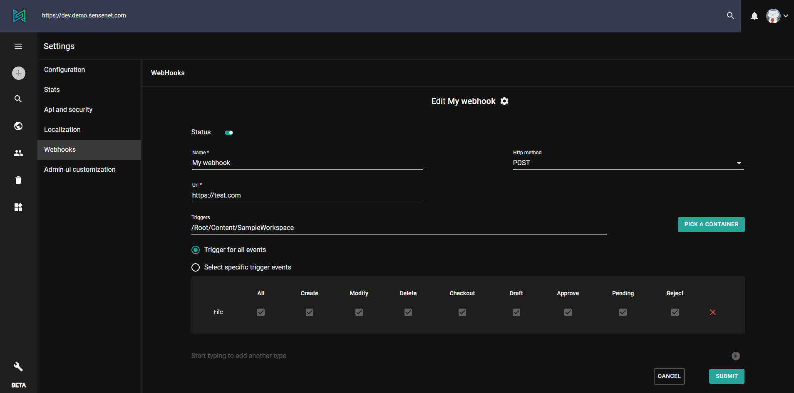

Webhooks are essential tools in a modern enterprise development scenario, when we work in an environment where many micro-services have to connect to each other. Webhooks let developers react to **events** that may happen inside a service - but without having to execute code directly inside that service.

# What is a webhook?
A [webhook](https://en.wikipedia.org/wiki/Webhook) is an event and a connected handler that can be anywhere in the world - e.g. a local data-center, in the cloud or a custom server - as long as it is accessible through an HTTP request.

When an event happens, the service - in our case sensenet - calls the configured callback using an HTTP request. It is the responsibility of the developer of the target service to handle the request.

The possibilities are countless, because developers may write their webhook handler using their preferred technology or integrating 3rd party services like [Netlify](https://www.netlify.com) or [Slack](https://slack.com/intl/en-hu).

# Webhooks in sensenet
Webhook are triggered by **content changes**. For example somebody uploads a new document or an editor publishes an article. To handle these events developers have the possibility to **subscribe** to them.

<note severity="info">In the future we may add additional events for non-content scenarios e.g. logging in or changing permissions.</note>

## Subscribing to WebHooks
Developers can subscribe to webhooks on the admin ui of sensenet. There is a flexible interface for defining the **events** developers want to react to and the specific **content types** and **containers** they want to monitor.



To learn more about how Webhooks work in sensenet and how can you subscribe to them, please [visit this article](/tutorials/webhooks).

## Handling the Webhook
When a Webhook is triggered it calls the URL defined in the subscription. The payload (data sent in the request) may look like the following example:

```json
{
    "nodeId": 123,
    "path": "/Root/Content/MyContent",
    "name": "MyContent",
    "displayName": "My Content",
    "eventName": "Modify",
    "subscriptionId": 456,
    "sentTime": "2021-02-18 06:55:00"
}
```

Using the data above the handler can make additional requests to the sensenet repository service, perform operations like archiving a document, sending notifications or calling another service that triggers a workflow.

## Diagnostics
In the future we will provide information about the success rates of WebHook requests and the health of the target service.
