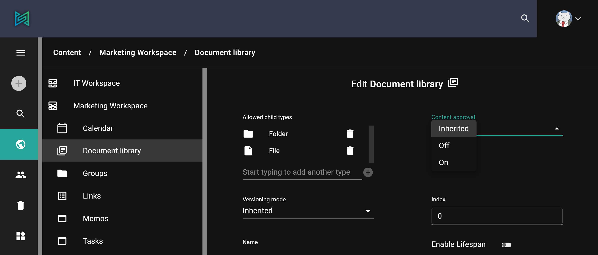
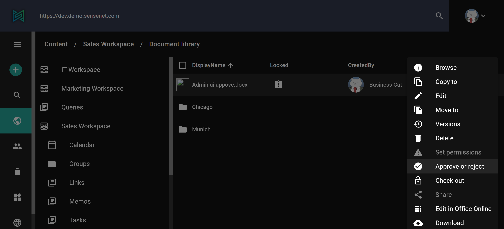

# Approval

On the admin-ui you can enable simple approval feature, that adds an extra step to the default publishing process. 
When approval is turned on, content needs to be sent for approval and can only be published when the review is finished and modification requests has been adapted (if applicable). 
In sensenet, approval is disabled by default. It can be enabled for folders or content lists with a right click on it, then selecting _Edit_. 
Here you can enable/disable Approval under _Content Approval_ section.

When approval is enabled a draft is born by the author which will be then sent for review - the system creates a version labeled Pending for approval (see “_Locked_” status in the picture below). This version is visible only for administrators and users who have permission to approve or reject it. The editor (or approver) can approve the document as it is, or propose changes. In this case the draft is modified and resubmitted by the author.
For example when Approval is enabled on Document Library, in case you upload a file the user who has to approve it will see _Locked_ status. Opening the Action menu _Approve or Reject_ option is visible.

When everyone is happy with the result, the document gets approved and published.
