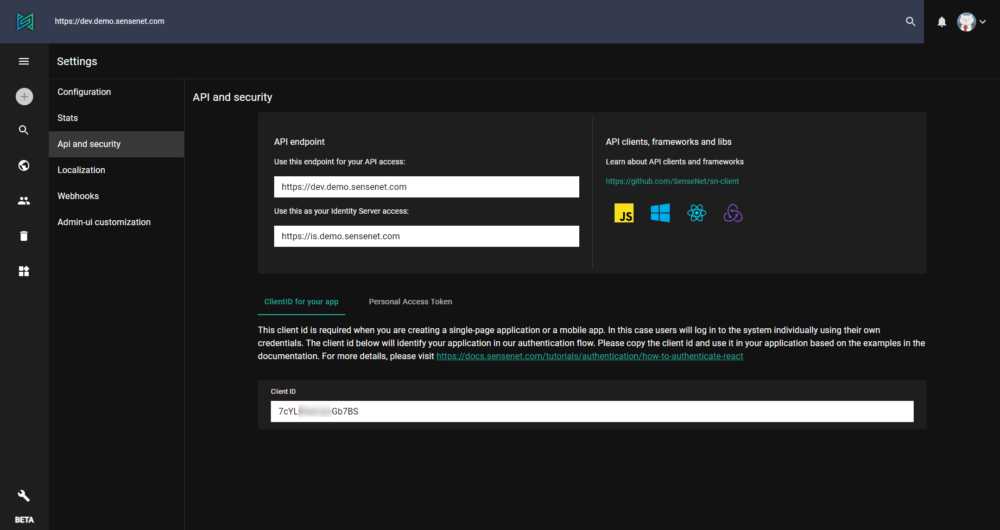
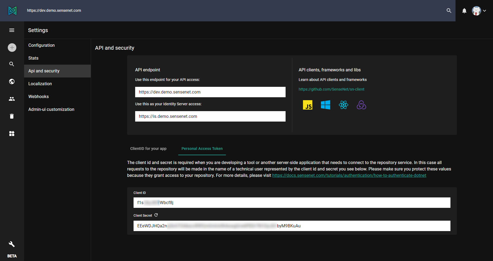

sensenet offers you a rich API allowing you to manage, integrate and deliver content on all types of clients, devices and platforms. sensenet content repository is an OData producer which means your application can consume our OData service to create web and mobile apps or any other type of content based applications. You can find more details about the API [here](https://docs.sensenet.com/api-docs/basic-concepts).

You can view API and security related information on the Admin ui under the **Settings / API and security** section.

The box at the top contains the basic info about the API: what is the endpoint of your sensenet content repository and what is your identity server url that is connected to your repository. The Identity server url is needed for [authentication](https://docs.sensenet.com/tutorials/authentication).

There are also some useful links that will guide you through how you can communicate with the API on different platforms.

If you are creating a single-page application or a mobile app you will also need a client id. In this case users will log in to the system individually using their own credentials. The client id will identify your application in our authentication flow which you can find on the first tab of the API and security page.

What if you are developing a tool or another server-side application that needs to connect to the repository service? In this case all requests to the repository will be made in the name of a technical user represented by the client id and secret.

*Note: This information is sensitive, make sure you protect these values.*

