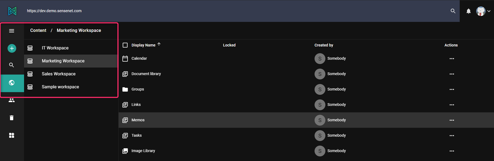

In sensenet it is possible to create a content from zero or to upload a file or folder. This article shows how you can create a new content.

# Create new
Let's see how you can create for example a new folder.
Folders are nodes in sensenet tree structure. They can contain files and/or other folders. You can easily create a new one, but first you need to select where you would like to create it.
Click on _Content_ in the menu structure on the left. You will see the basic built-in workspaces in sensenet, containing default content types, folders and files.  Under *Marketing workspace*, for example, you can find *Document Library*, *Image library*, *Memos*, *Calendar* etc., and all of these contains different contents.

To create a new folder in *Marketing workspace/Image library*, open this specific folder by clicking on it. Click _Add_ on the top left corner and select *Folder*. The list shows all the content types you can create in this folder.

In the opening window you can give the folder a name, define the lifespan (the content is valid, visible from date to date), and also give index number. This last one is useful for filtering and sorting the content: for example you create different contents at the same time and you would like to put them in custom order. You can do it by giving different index number to each content. You can then filter and order them based on this index number.

In the sensenet content repository it is possible to define restrictions on what content types the different containers can contain (allowed child types). For example a *Calendar* can only contain *Events*, a *Document Library* can only contain *Folders* and *Files*, etc. This allows you to create a much more precisely defined content structure and provides control on the long run. These settings can be overridden on the specific content, for example you can modify any of your document libraries to contain images too. To learn more go to [allowed child types article](/concepts/content-management/06-allowed-child-types)

# Upload file
It is possible to create a new content in sensenet also by uploading a file or a complete folder (supported only on Chrome). You can do it in the same way, by clicking on *Add* in the left side menu and selecting *Upload*.
It is possible to upload images, pdf, word, excel or ppt files and so on. Bulk upload feature is also available.

Basically, all the new content you would like to create in sensenet you can do in the same way, using the _Add_ function in the Menu on the left.
