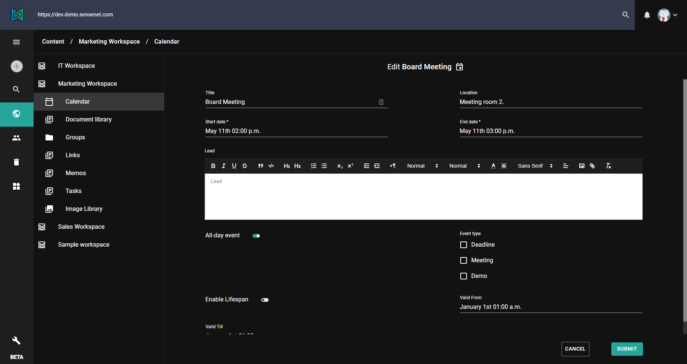

Contents can be edited right on the admin ui. Different [content types](/concepts/content-types) has different [fields](/concepts/content-management/031-fields) which can be edited by selecting "Edit" action from the right click (or three dots) menu of a content item.

# Field editing

In this example you can see the edit view of a calendar event. Here you can modify *Title*, *Location*, *Start/End date* and other fields available on the content.

Once you're done editing, click *submit* to save your changes to the content.

As mentioned above, different content types has different fields.
For comparison, here's the edit view of an image (jpg):

# Office Online editing

Beside editing the fields of different content items, sensenet supports Office Online editing in case of word, excel and powerpoint files.

This allow users to open Office documents without a desktop app and to easily collaborate (edit the same document at the same time).

To open a document in the online editor, click on the right click (or three dots) menu on a compatible content (in this case a docx file) and select *Edit in Office Online* option.

After this, a feature-packed online editor reveals, where you can do many things which could be familiar from the desktop version of Office. You can edit the same document at the same time and all the changes are saved automatically.
You can go back to the content tree with the *cancel* button at the bottom right corner.

> please note that the feature set is limited compared to a full-fledged desktop Office

> [learn more about Office Online editing (concept docs)](/concepts/collaboration/03-office-online-editing)
