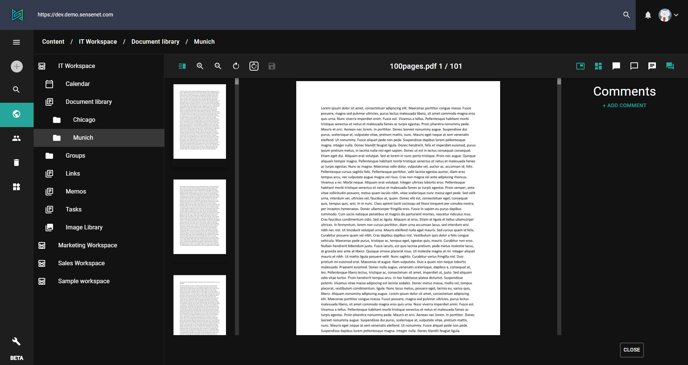
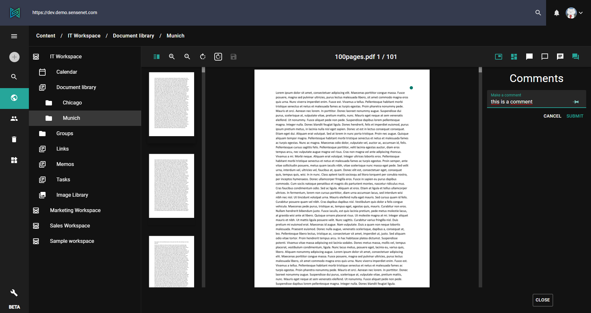
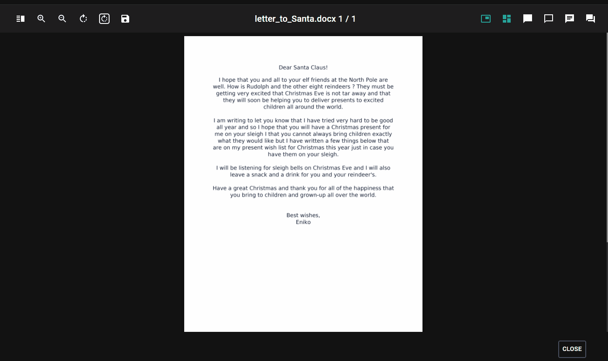
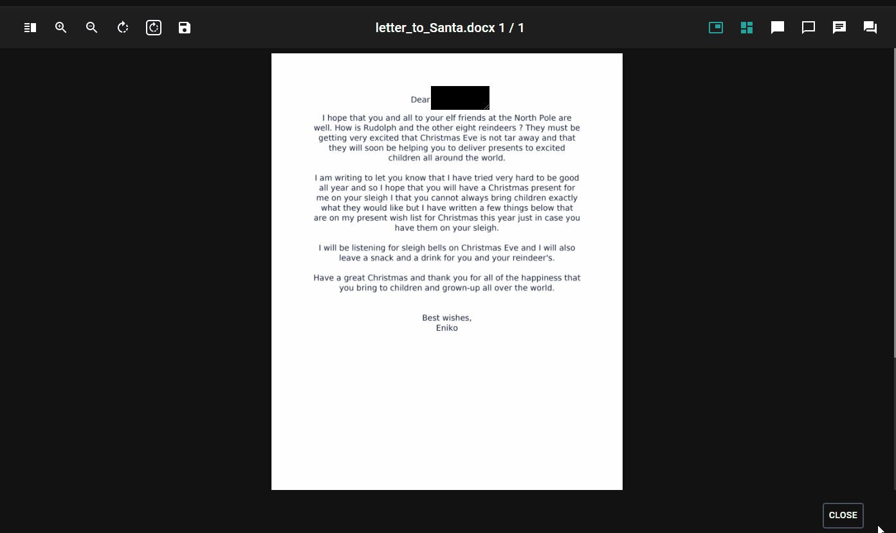
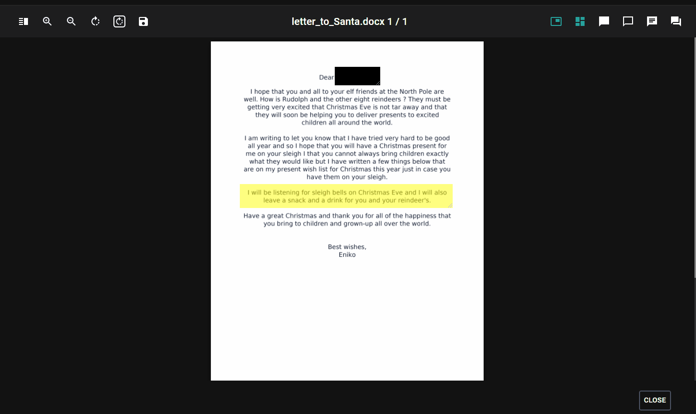
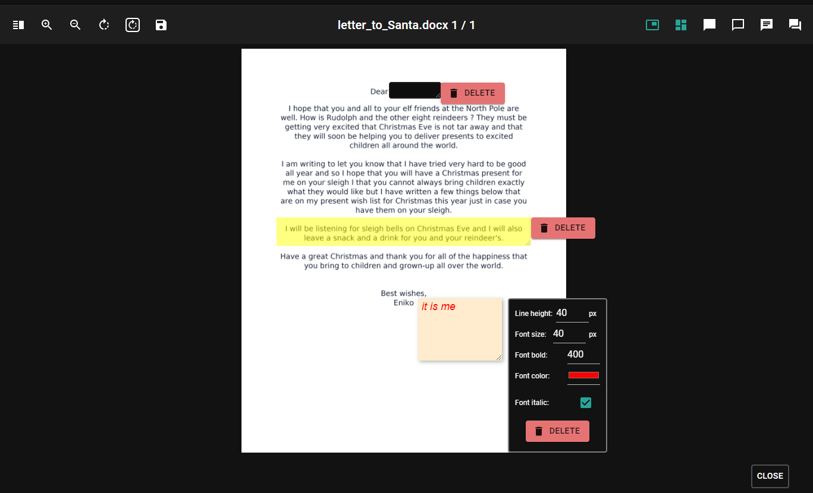

sensenet has a powerful preview feature available on the admin ui (and through API as well). It enables to preview multiple types of documents right in the browser (no download or any third party application needed).

> [Learn more about the preview feature (concept docs)](/concepts/document-previews)

# Preview in action
Once a file is uploaded, the system (depending on the configuration) starts generating preview images in the background. After the process is finished, the preview of the file is accessible by double clicking the content or by selecting "preview" from the action menu.

The preview tool has some basic features like zoom or document rotation accessible by the action buttons in the top toolbar. Here you can also toggle the thumbnail pane or add comments to any part of the document.

## Comment
To add a comment to a document, open preview and click the "toggle comments" button at the top right corner.
Now place the marker in the document by single clicking the desired place. Write your comment in the text field and click submit. That's it. Existing comments (from all users) will appear in the comment list along with markers in the document (only in preview mode).

## Shapes

**Redaction**

Sometimes when you are working with sensitive information in documents you don’t want to share them with everyone, only users having the appropriate privileges. What if you would like to share the document except the sensitive information? This is the case when you need to apply redaction.
With this feature you can hide parts of your doc with a black rectangles. Opening a document without redaction is only possible if the user has permission for it, otherwise the page will be full with black squares.

**Highlight**

The purpose of highlighting is to draw attention to important information in a text. 📑

**Annotation**

Annotation is extra information associated with a particular point in a document. It can be a note that includes a comment, explanation or anything what you would like to share with the audience in a designated place in the text.

**Usage**

The operation of these three shapes is basically the same with some small differences:
- you can create them with a click-move-click method (check gifs) ✏️
- you can delete them with `backspace` or `delete` keys (except annotations) and also with a `right-click` on the shape then choosing delete button on the popout. 🚮
- you can also drag and drop the shapes if you would like to move them to another position on the page. ↖️↘️
- right-clicking on shapes opens different popups. For the redactions and highlights only a delete button appears, but for annotations, a toolkit with different configuration options 🔧 shows up where you can set line height, font size, font color and make your text **bold** or _italic_.

