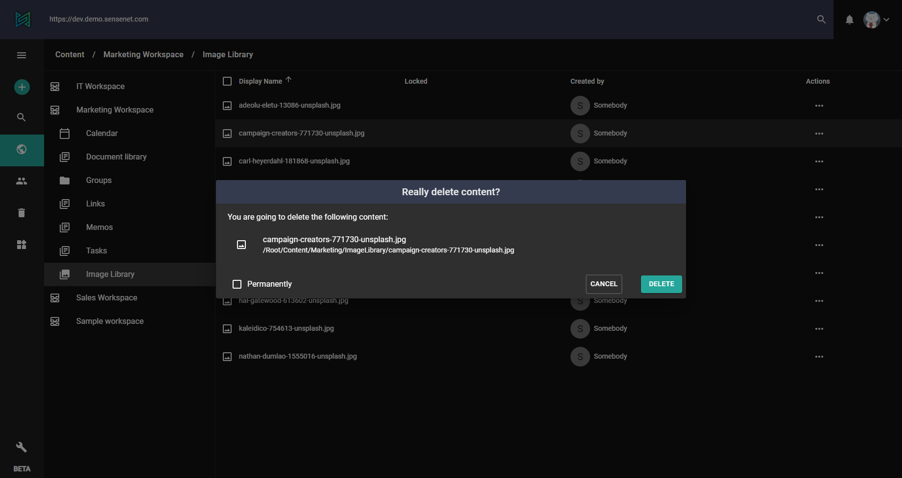

In sensenet deleted content goes to the trash (this is a system default). You can find them by clicking on the trash icon in the left menu.
> [Learn more about trash feature (concept docs)](/concepts/collaboration/05-trash)

# Deleting an item

Delete is available via the action menu (three dots or right click) of a content item.

The system displays a confirmation dialog where you can confirm or cancel the process and you also have the possibility to permanently delete the content (and skip trash).

# Trash actions

When an item is trashed you can still perform "regular" actions on it like browse, edit and so on. When a trashed item is deleted it means that the content is removed permanently from the system.

Restore is only available [through API](/api-docs/content-management/07-trash) at the moment.
