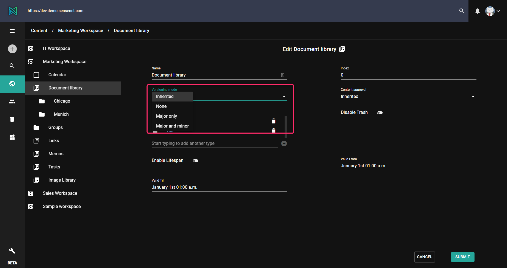
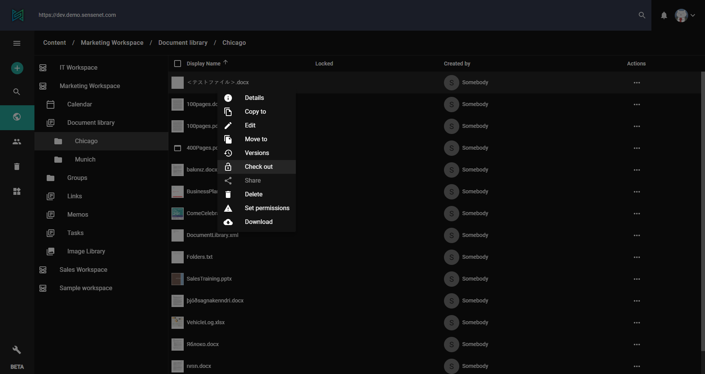
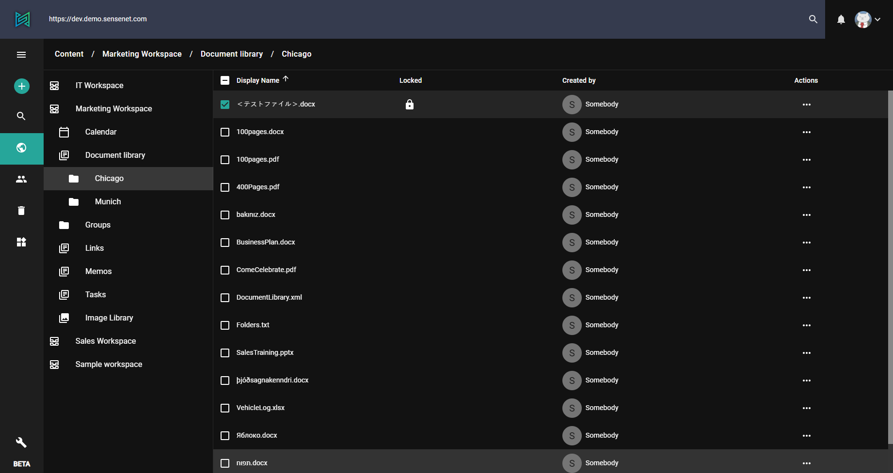

Versioning is the management of changes to documents and other informations stored in a file system or respository. With versioning you can keep the published version of a document visible to non-editor users, while you are working on the latest, draft version.
> In sensenet versioning is disabled by default.

# How to set versioning on the admin-ui?

You can enable versioning for folders or content lists by selecting the folder/file, clicking _Edit_ and selecting the _Versioning Mode_.

> Subfolders inherit versioning settings by default.

# Versioning modes
**None**: The default setting of the Root folder, no versioning.

**Inherited**: The folder inherits its versioning mode from its parent. This is the default setting for all other content.

**Major only**: Only major versions (1.0, 2.0,…) are preserved. After a user finished editing a content, the major version number is bumped by default (e.g. 1.0 becomes 2.0). This means the new version is automatically published, and will be served to all users requesting the content in question.

**Major and minor**: Every version is preserved (1.0, 1.1, 1.2,…). In this mode, saving a content bumps its minor version number first. Content with minor versions (for example 1.2, 3.5, anything but x.0) are considered working versions, and aren’t served to guest users - they get the latest major version instead. (e.g. if a document’s latest version is 5.4D, guest users will be served 5.0A, the latest public version.) In this versioning mode, bumping the major version and thus publishing the changes can be done by using the Publish action. You can change versioning or approving mode on any folder or other container type. If you visit the edit page of the folder you'll find the versioning and approving settings among the advanced fields.

The following example shows you how to checkout (lock) a document:

In the same way you can checkin the file.

To know if a file is currently checked out see the lock symbol.

