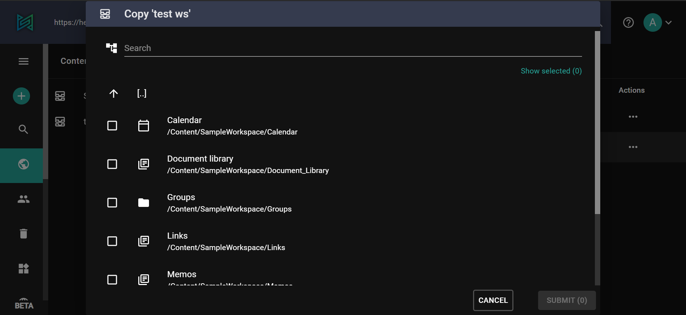
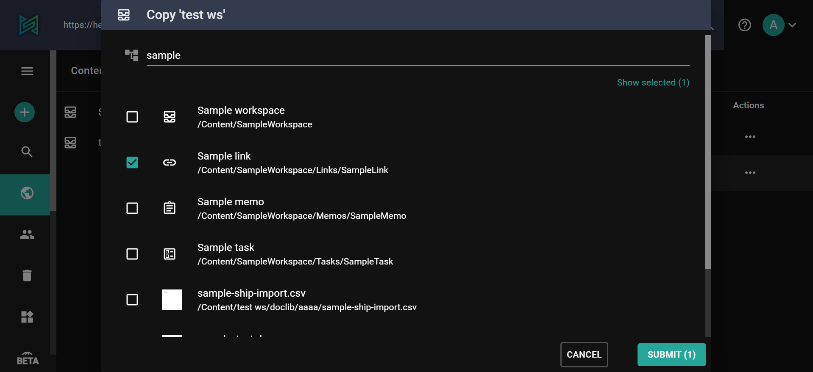
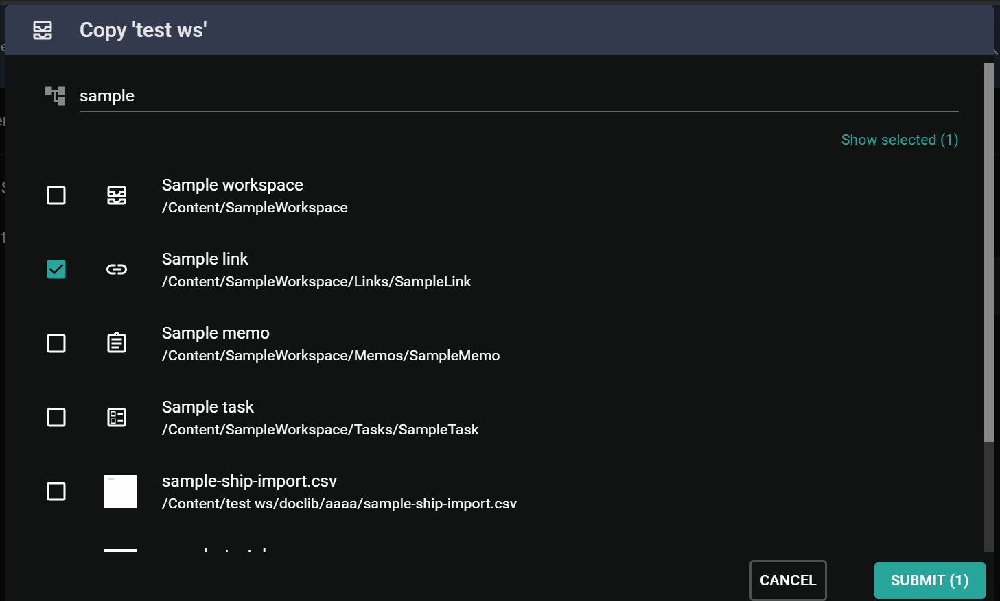

The content picker is a tool that allows you to select one or multiple elements from your content structure. We use it in several parts of the admin-ui with specific settings for each use case, eg. copy or move a content, restore from trash, set value for a reference field.

The picker has three different modes: content tree browse, search and current selection.
The main pane always shows a list of contents based on the currently active mode. You can select/deselect a content by left clicking on the checkbox of the list element.

Content tree browse view is the default mode when you open a picker, it can also be activated anytime by clicking the icon left to the search input. It is similar to content browser, you can navigate up and down within your folder structure by double clicking on folder items.

If you know exactly what you're looking for, you can search for a specific content using the **search** bar. This mode is activated by clicking the search input and gives results based on DisplayName and Name fields.

**Selection** view is activated when you click on the 'Show selection' link between the search input and the results.
This lists all selected items and you can also deleselect them.

## Connection between reference field configuration and the picker

The [reference field](/concepts/fields/09-reference)'s configuration can influence the operation of the Picker when you try to set a new reference.

### Relevant configuration options:

**AllowMultiple:** a boolean property defining whether multiple selection is allowed

**DefaultValue:** one or multiple content which are selected automatically

**SelectionRoot:** allowed location or locations to select content from. If the given paths form a disjoint set, then a new virtual level is created in the root of the tree with the top elements.
