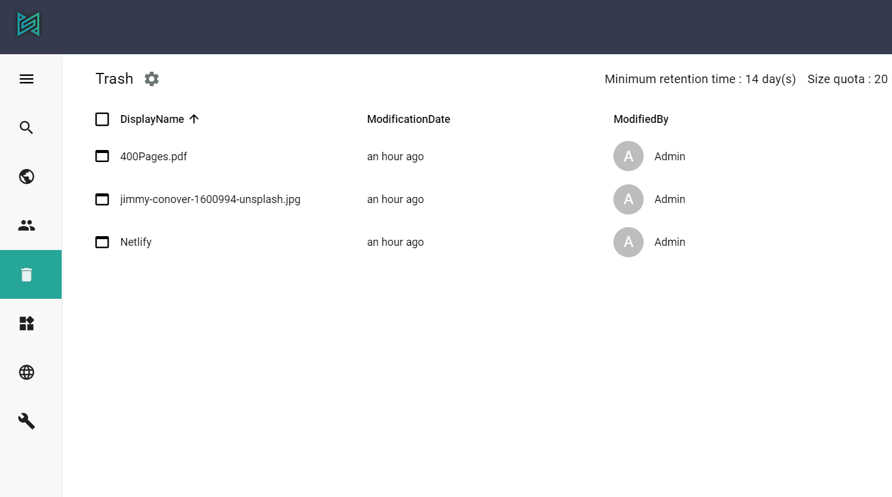
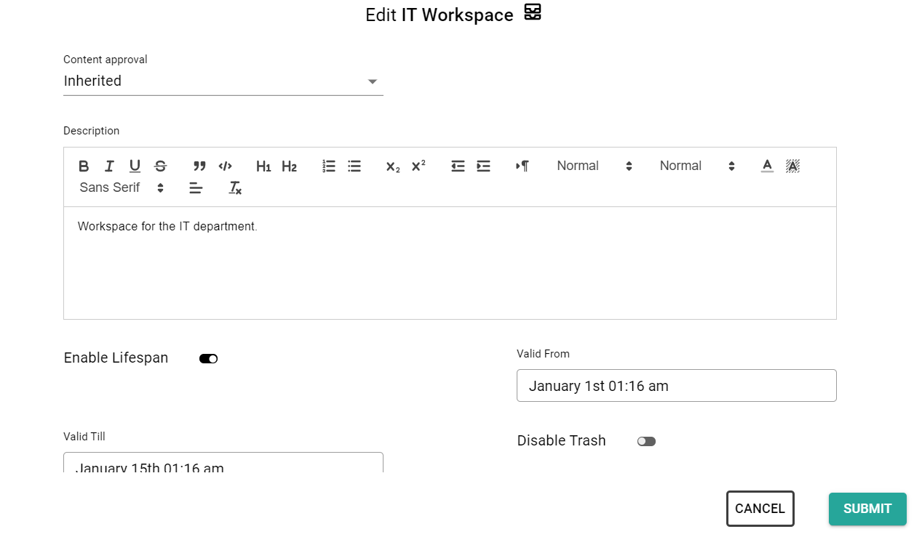
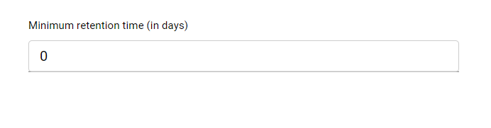
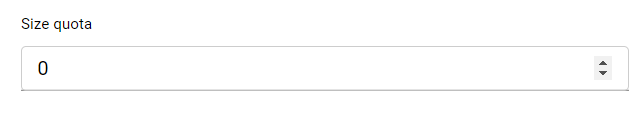
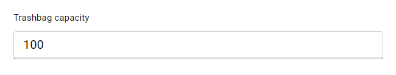

## Enable/disable the trash feature globally

If the trash is enabled in the system (by default it is enabled), deleted content can be moved to the Trash Bin. You can find them on the path `/Root/Trash`.
If you disable the trash, previously deleted content won't disappear, you or the owner can restore them freely. Content deleted with disabled trash will be removed permanently from the database.
Disabling trash globally can be achieved by changing the Trash content's `IsActive` field's value. This field is available on every workspace and Trash is a workspace content as well, so you can take advantages of the 'everything is a content' approach in this case and switch of trash functionality by editing the `/Root/Trash` content.

## Disable the trash feature on a container

You can enable or disable the trash feature on almost any container content. By default, the feature is enabled and deleted content go to the trash. You can change this with editing folder or list content itself. This setting affects only the container (list, workspace) you edit, and not the child folders.

## Trash bin options
Trash Bin options can be edited through API or on the admin-ui with editing the `Trash` content itself because the following configuration options are stored as its metadata.

## Set the retention time of deleted contents
The value set here is the amount of time (in days) the content should stay in the trash before it could be permanently deleted. If the value is greater than 0, users (or any automation) cannot remove the content from the trash before the expiration date. Changing this value does not effect previously deleted content.

## Set the size of the Trash Bin
The size quota is the amount of content in megabytes that can be stored in the trash. This value is only a UI hint, it does not effect deleting content. If the size is exceeded the Trash Bin main page will display a message about how much space is used. The administrator should take care of purging content from the trash manually.

## Set Trash Bag capacity
If you provide a number greater than 0 as the Trash Bag capacity, only containers having a smaller number of children can be moved to the trash at the same time. This setting effects only one delete operation. In case this setting prevents you to delete a big subtree you can still delete those content one-by-one.

