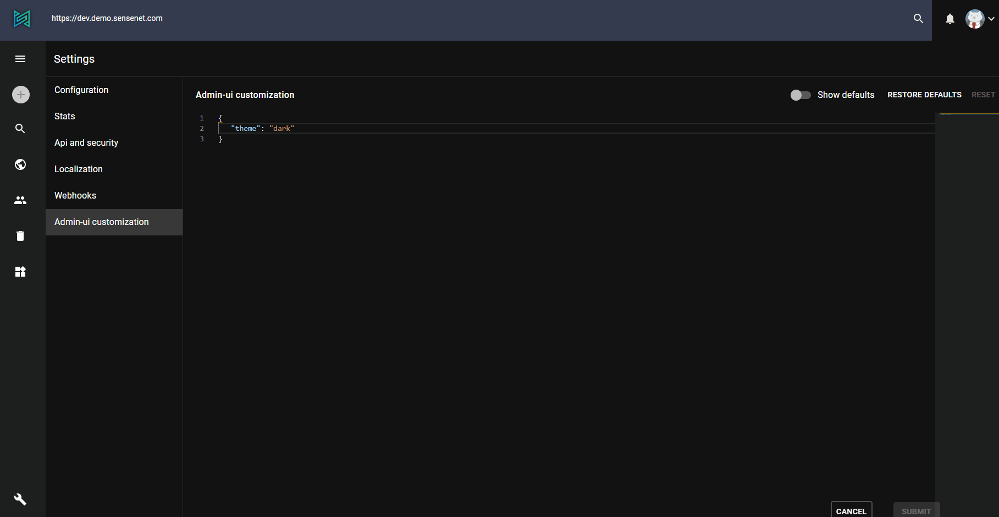

There are several things that you can customize according to your taste on the Admin UI. You can do most of them on the 'Admin ui customization' page. You can open your settings by navigating to the Settings / Admin ui customization menu:

The settings are stored in a JSON format but you can get some help with the available settings by pressing the **CTRL+SPACE** combo.

Your personal settings are stored in your browsers local storage, so it won't be there if you use another browser or clear the browser cache, but can be recreated or overwritten anytime again and if there's no custom settings in the local storage, you can see and use the admin-ui by the default settings.

## Default, Mobile, Desktop, Tablet

Some settings can depend on the device that you use. You can set different settings for these devices - and a default value that will be applied if you don't provide a setting on device level.

### Theme

You can change between **light** 🌞 and **dark** 🌜 theme. (It is also possible to change the theme by one click in the user menu dropdown)

### Drawer

You can enable or disable the [drawer](/guides/customization/01-menu-customization/), change the drawer type and define a list of pre-configured items to display. The drawer types are:

- *temporary*, useful for mobile devices
- *permanent* with icons and text
- *mini-variant* which displays only the icon by default but can be expanded

### Command Palette

You can enable or disable the [command palette](/guides/search/03-command-palette/) and define a `wrapQuery` expression that will be added to any command palette query.

## Language

You can select between the `default` (english) and `hungarian` language with the `language` field.

## Events and logging

You can define the size of the event log with the `eventLogSize`. Only the last N entries will be saved. There is another setting for the entries to persist in the log: the `logLevel` field. You can also enable / disable attaching the log when you send a crash report with the `sendLogWithCrashReports` field.

