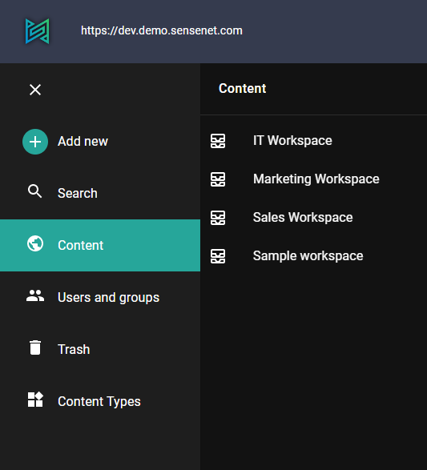
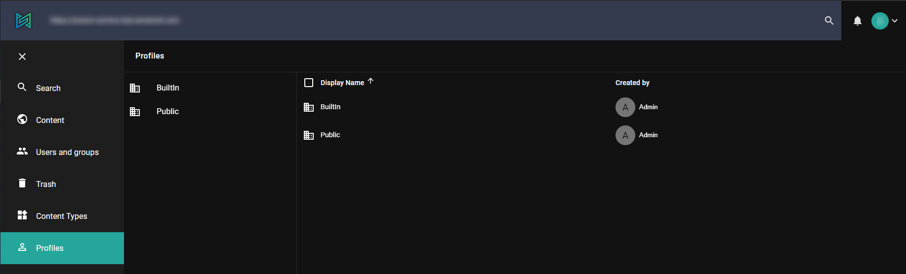

The Drawer component is the left side navigation menu. It lets you access the content, search, content types and more other menu items.

## Customization

You can customize the drawer within the Admin ui customization. You can set drawer options for multiple devices. For example mobile, tablet, desktop and in general for default. There are 3 main options:

1. [enabled](#enabled) - boolean value (it can be `true` or `false`)
2. [type](#type) - string value (`"mini-variant"`, `"permanent"`, `"temporary"`)
3. [items](#items) - array of custom DrawerItems (this is a complex type, look for examples below)

### Enabled

This it the simplest setting that can enable or disable the drawer itself.

Example setting:

```json
{
  "default": {
    "drawer": {
      "enabled": false
    }
  }
}
```

### Type

There are 3 possible values for choosing the type of the drawer:

**mini-variant** - This can be opened and closed as it is shown below. _This is currently the default setting for desktop mode_


**permanent** - In this mode the drawer is always open.



**temporary** - In this mode there is no sidebar only a hamburger menu in the top left corner. _This is currently the default setting for mobile mode_


### Items

With items you are able to add custom menu items to the drawer.

Every drawer item has 3 properties, `settings`, `itemType`, `permissions`.

The `settings` contains basic configurations of a drawer item:

|--|--|
|appPath| string | it will be added to the url to define context |
|root| string | root path of the menu |
|icon| string | name of the icon of the drawer item |
|title| string | this title will be displayed in the menu next to the icon |
|columns|Array of strings| list of fields names (columns) that you want to display when user opens this menu|

The `itemType` is a predefined string, that should be set to `CustomContent` in case you want to add a custom menu item, you can see the possible values with pressing **CTRL+SPACE** in the editor.

The `permissions` property is an array of objects that has a path and action property. The name of the action that will be checked against the path. With this param you can set, that existence of which actions are required to see and use the menuitem. For example the to see the Localization menu item the user should have permission allowed to add a new localization file into this container, in other words 'Add' action should be available for him on the Localization folder.

```json
{
   "default": {
      "drawer": {
         "items": [
            {
               "itemType": "CustomContent",
               "settings": {
                  "columns": [
                     "DisplayName",
                     "CreatedBy"
                  ],
                  "appPath": "profiles",
                  "root": "/Root/Profiles",
                  "icon": "User",
                  "title": "Profiles"
               }
            }
         ]
      }
   }
}
```



