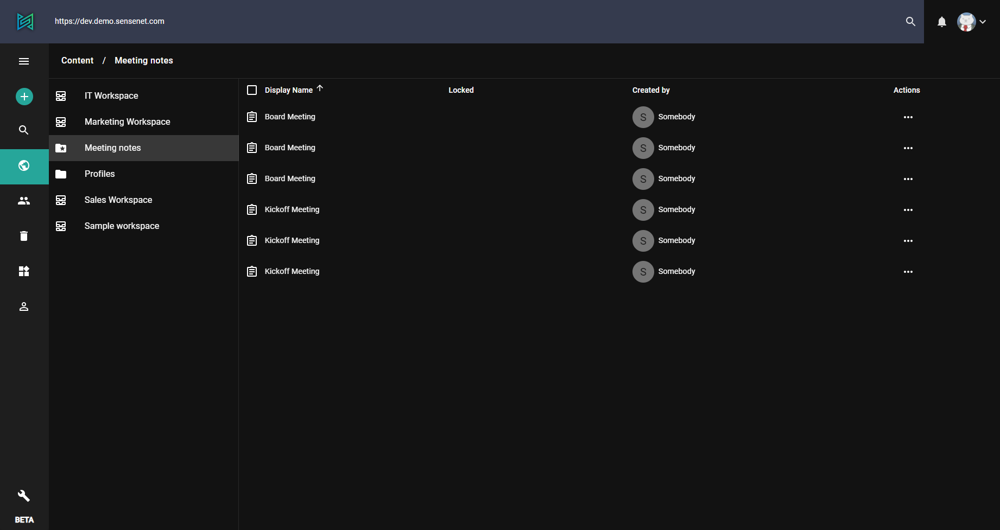

The Drawer can be customized with the [personal settings](./00-personal-settings) editor you can add custom menu items binding them to subtrees or subfolder by your choice. If you want to create a menu item based on query results it is also possible combining [SmartFolder](/concepts/basics/041-content-query#smartfolder) type and custom drawer items.

# Create a SmartFolder with a custom query

Add a new content with the type SmartFolder with the following query (with this query you can get the list of memos with the word *meeting* in their title):

```+TypeIs:Memo +DisplayName:*meeting*```

If you open your newly created SmartFolder you can see that it grouped all those memos from the repository that have the word *meeting* in their title.



# Add a custom drawer item to open the SmartFolder

With addig a custom drawer item to the menu binded to the above mentioned SmartFolder, you can basically create a quick link to the query results. Add the following to the personal settings:

```json
{
  "default": {
    "drawer": {
      "items": [
        {
          "itemType": "CustomContent",
          "settings": {
            "title": "Meeting notes",
            "icon": "MemoList",
            "root": "/Root/Content/Meeting notes",
            "appPath": "meeting-notes",
            "columns": ["DisplayName", "ModifiedBy", "ModificationDate"]
          }
        }
      ]
    }
  }
}
```

You should see exactly one menu item that looks like this.


There are few options that you can use for customization:
  - icon - name of the icon that you want to display in the drawer
  - title - this is shown in two places. In the tooltip and in the view as well
  - columns - array of columns to display. These are the name of the fields on the content
  - root - content that should be the root of the custom menu, in this case the path of the **SmartFolder**
  - appPath - this name will be added to the url as the scope of the menu, in this case *https://admin.sensenet.com/custom/explorer/meeting-notes/*
