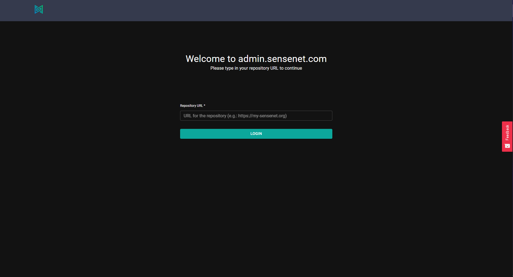
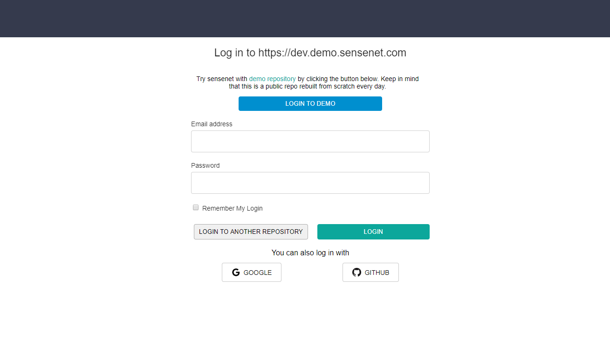
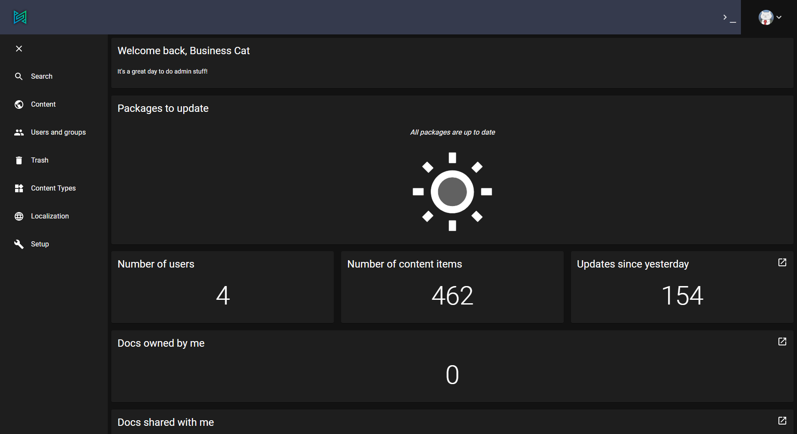
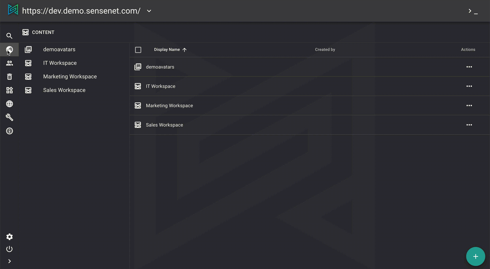
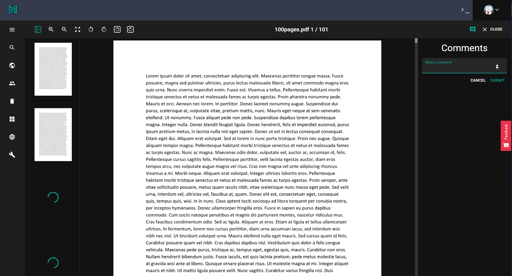
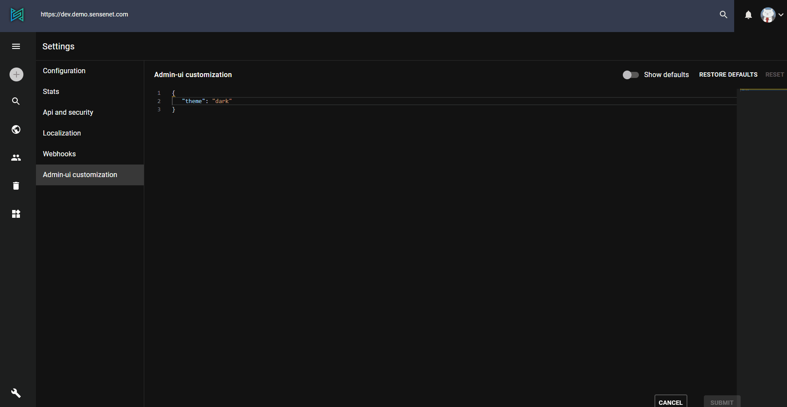

sensenet has an admin ui to manage repos and do basic content management actions. In the following you can read about the different features of the admin surface.

# Login

Since admin ui is a central place to manage sensenet repositories, everyone uses the same site and login screen. First, you need to type the **url of the repository** you want to connect to, then log in with username and password.

To test the admin ui without your own repo, you can log in to ours by clicking ([here](https://admin.sensenet.com/?repoUrl=https%3A//dev.demo.sensenet.com)).

> You will be logged in with an **admin user** called Business Cat.

# Menu and dashboard
Once logged in you can see the admin ui in its whole beauty with different actions in the left pane menu and a nice dashboard with the most important info about your repo.

By default the sidebar has the following items:

**search**: execute custom searches, build and save queries

**content**: explore and manage your content in the repository

**users and groups**: manage users and groups, roles and identities

**trash**: a place for all trashed items

**content types**: manage content types ([more about content types](/concepts/content-management/03-content-types))

**localization**: manage string resources

**setup**: configure sensenet system ([more about setup](/guides/setup))

<note title="pro tip">Menu items can be customized in personal settings.</note>

# Content

In the content pane you can browse the content repo and execute basic document management actions (open, edit properties, copy, move, delete). You can find these actions by clicking the three-dot menu on a content row.

Please note that different content types has different actions.

## Edit

Thanks to office online editing, some documents (like word and excel files) can be opened and edited without any desktop app involved.

## Preview

sensenet has a built-in preview generator which allow users to open pdf, docx, txt and other files in ready only mode.
Clicking open on a supported file will bring up the already generated preview images of the content in question.

## Add new

By clicking plus button in the sidebar you can add content to repo either by uploading or creating.

<note title="pro tip">Allowed types under a specific content can be set by modifying <a href="/concepts/content-management/06-allowed-childtypes">allowed child types</a> property of the content.</note>

# Personal settings

In personal settings you can customize the admin surface

- content views
- events and logging
- language
- display additional menu items

<note title="pro tip">You can bring up intellisense with ctrl+space shortcut to get context based suggestions.
<a href="/guides/dashboard-customization">Learn more</a> about personal settings in admin ui.</note>

