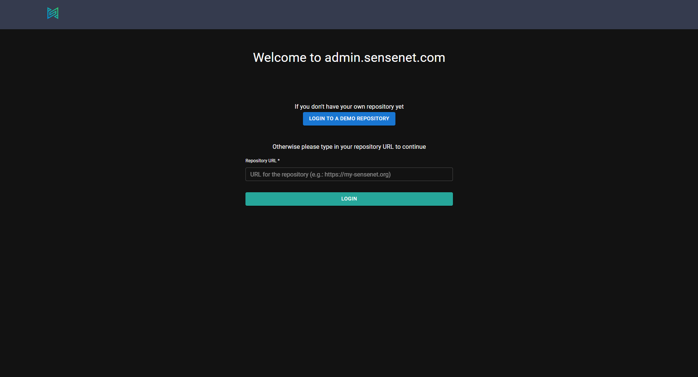
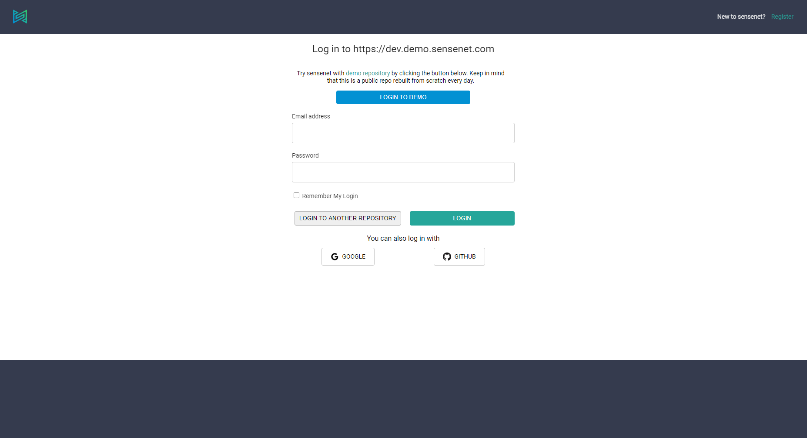
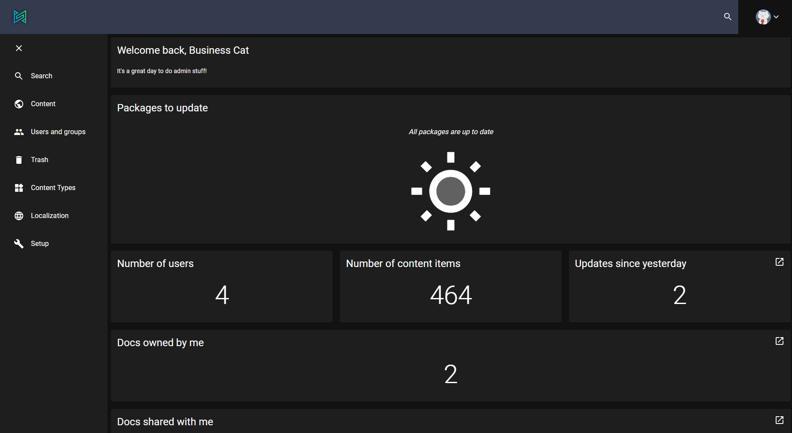
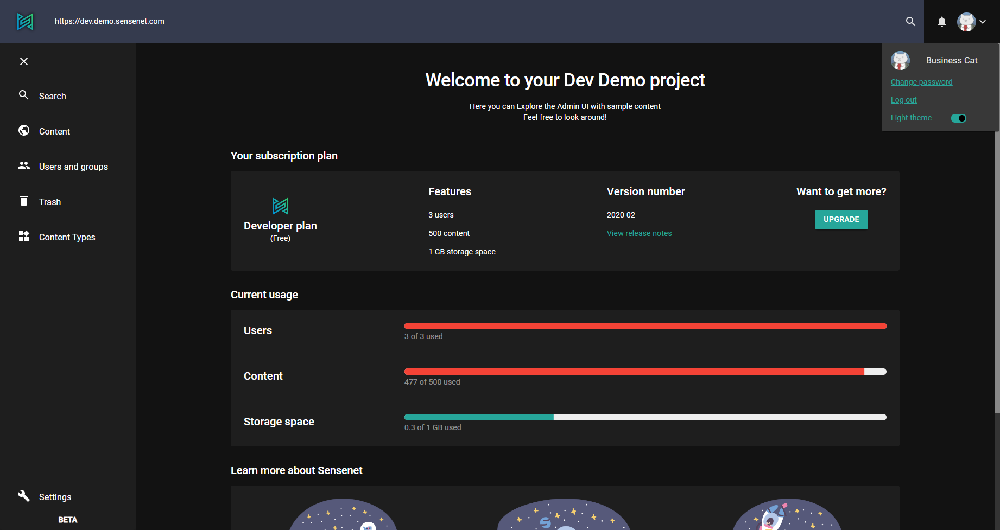

sensenet has an admin ui which enables you to connect to your repos and do basic content management actions. In the following you can learn about the different features of the admin surface.

# Login

Admin ui is a central place to manage sensenet repositories by logging in to a specific repo with the correct credentials.
First, enter **repository URL** then log in using your email address (and password) or your Google, GitHub account.

If you don't have a repo yet, you can get one [for free](https://is.sensenet.com/Account/Registration?returnUrl=%2Fconnect%2Fauthorize%2Fcallback%3Fclient_id%3Dspa%26redirect_uri%3Dhttps%253A%252F%252Fprofile.sensenet.com%252Fauthentication%252Fcallback%26response_type%3Dcode%26scope%3Dopenid%2520profile%2520sensenet%26state%3Dde66e02398b748f5b102fe2fc8911be7%26code_challenge%3DOHs2GpcPZ_H9seg0sP-nd-f1J1in9IgGqadms7Jp-jU%26code_challenge_method%3DS256%26response_mode%3Dquery%26snrepo%3Dhttps%253A%252F%252Fsnover.service.sensenet.com) or log in to our demo repository by clicking the big blue button either on repo url or login screen (see below).

<note>
You will be logged in with an **admin user** called Business Cat.
</note>

# Menu and dashboard
Once logged in you can see the admin ui in its whole beauty with different actions in the left pane menu and a nice dashboard with the most important info about your repo.

By default the sidebar has the following items:

- **search**: execute custom searches, build and save queries - [more about search in admin ui](/guides/search)
- **content**: explore and manage your content in the repository - [more about content tree in admin ui](/guides/content-management/content-tree)
- **users and groups**: manage users and groups, roles and identities - [more about roles and permission](/guides/roles-and-permissions)
- **trash**: a place for all trashed items - [more about trash in admin ui](/guides/content-management/trash)
- **content types**: manage content types ([more about content types in admin ui](/guides/content_types)
- **settings**: configure sensenet system ([more about settings](/guides/settings))

<note>
Sidebar can be expanded/collapsed by clicking the "hamburger" icon at the very top of the bar
</note>

# Miscellaneous

You can change password, log out or switch between dark and light theme by clicking on your avatar at the top right corner.

