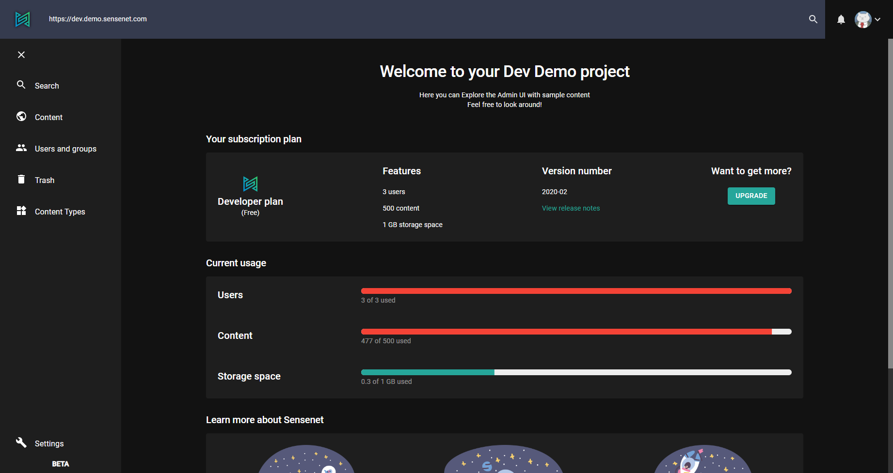

sensenet has an admin-ui which enables you to connect to your repos and do basic content management actions. In the following you can learn about the different features of the admin surface.

# Login

Admin-ui is a central place to manage sensenet repositories by logging in to a specific repo with the correct credentials.
First, enter **repository URL** then log in using your email address (and password) or your Google, GitHub account.

If you don't have a repo yet, you can log in to our demo repository by clicking the big blue button either on repo url or login screen (see above).

> You will be logged in with an **admin user** called Business Cat.

# Menu and dashboard
Once logged in you can see the admin-ui in its whole beauty with different actions in the left pane menu and a nice dashboard with the most important info about your repo.

By default the sidebar has the following items:

**search**: execute custom searches, build and save queries - [more about search in admin ui](/guides/search)

**content**: explore and manage your content in the repository - [more about content tree in admin ui](/guides/content-management/content-tree)

**users and groups**: manage users and groups, roles and identities

**trash**: a place for all trashed items - [more about trash in admin ui](/guides/content-management/trash)

**content types**: manage content types ([more about content types in admin ui](/guides/content_types)

**localization**: manage string resources - ([more about localization in admin ui](/guides/localization)

**setup**: configure sensenet system ([more about setup](/guides/setup))

# Miscellaneous

You can log out or switch between dark and light theme by clicking on your avatar at the top right corner.

