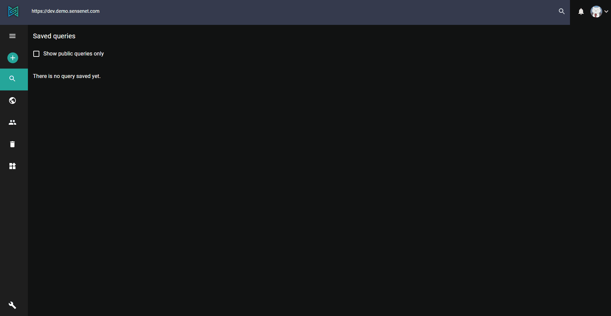
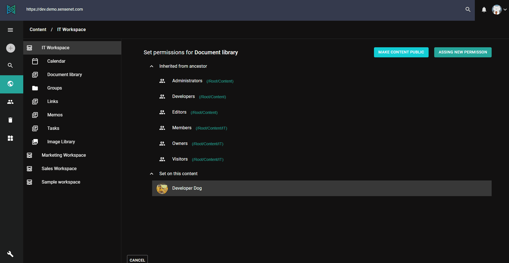

# Permission editor

sensenet offers a sophisticated permission system, giving you the possibility to apply permission rules according to the logic you prefer. The permission editor is available on the admin ui.

There are a lot of built-in permissions but there are some reserved ones that you are free to use in case you have special needs (custom permissions). You can also group these permissions for the permission editor. The related settings file is available under Setup menu / Permission.settings.
On the permission editor dialog you can see the groups and permissions based on these settings.

You can assign users to roles taking advantage of predefined permission settings to that role. Since permissions are not directly assigned to users, they only acquire them through their role (or roles), management of individual user rights becomes a matter of simply assigning appropriate roles to specific users; this simplifies common operations, such as adding a new user, or changing a user’s department.

# How to set permissions?
Select a content from your repository, right-click on it and select *Set permissions* from the dropdown. On the permission view you can check the permission entries (users or groups) which are inherited or set directly on the current content. Selecting an entry opens the permission editor dialog.
On the dialog use the switches to enable/disable a permission. There are also group level switches, so you can easily enable/disable all the permissions in the selected group. There is also *Full access* functionality, with which you can turn all permissions on/off.

When you open the dialog some permissions are disabled because they are inherited from a parent and you cannot override them. Changes only apply on clicking *Submit* button so for your comfort there is also a reset button to restore the unsaved changes.
If you would like to grant permission for someone on a content who has no permission setting at all, you can do it using the **Assign new permission** button. Search for and select the user or group to whom you want to set permissions and turn on/off the switches.

If you would like to share content with visitors who are not users in your repository (for example in case of a public website), you can do it easily with **Make content public** button, and with the same button it is possible to revert it.

There are cases when you want to allow certain users to see a content (e.g. a Content List) but you do not want them to be able to see contents that are inside this container. To avoid permission inheritance, mark permission entries as 'local-only'. On the permission view these local-only entries are marked with an icon.

To read more about sensenet permission system:
> [Document level permissions(concept docs)](/concepts/user-and-permission-management/02-document-level-permissions.md)
> [Role based permissions(concept docs)](/concepts/user-and-permission-management/03-role-based-permissions.md)
> [Custom roles and permissions(concept docs)](/concepts/user-and-permission-management/04-custom-roles-and-permissions.md)
