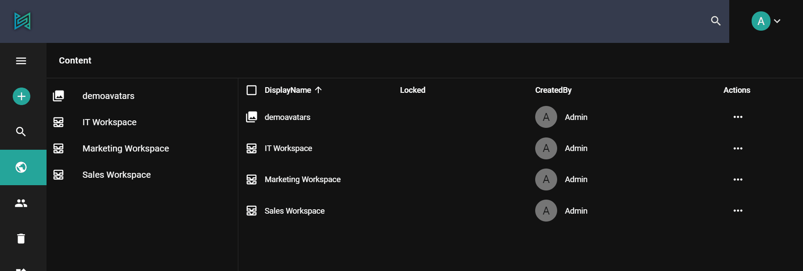
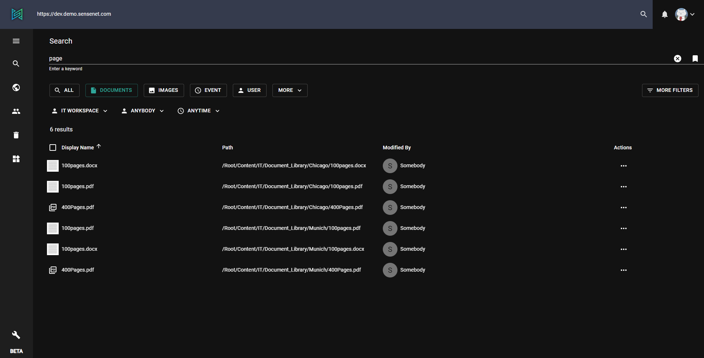

In sensenet one of the most important and sophisticated feature is **Search**.

As everything is a content in sensenet your query results cannot contain only files, but also users, tasks, workspaces etc.
It is possible to search even in uploaded documents.

It is possible to extract all relevant terms from a text, filtering stop-words (like "a", "an", "and", "are", "as", "at", "be", "but", "by", "for", "if", "in") etc. In case your document contains the following text: „Writing Sentences” and your query text is „writing”. The original text can be found even if the query word typed in and the word in the original text do not match exactly char-by-char. You can get relevant search results even if you have a typo in your query or a different verbal tense.
_Full Text Search_, _Fuzzy Search_, _Proximity Search_ and _Boosting_ make your query results more complete.

To learn more about the methodology behind this feature, check [search article](/concepts/basics/04-search) in the concept docs.

The admin-ui gives you two options to search in your repository: Use the command palette or the more customizable search page. You can find the detailed documentation of the command palette [here](/guides/search/03-command-palette).

The search page is available in the [following link](https://admin.sensenet.com/search). It searches in the `Name` and `DisplayName` fields. You can filter the result set to easily find what you want.

## Filter options:

Type filters are shown by default. The others are only visible if the _More filters_ button is active.

### Type

You can narrow the results to one content type. It also gives back the derived types to handle your custom ones. Below the search box click one of the buttons or select from the more list to set this filter.

### Path

Set the root folder of the search. It includes all child content as well as the base one.

### Reference

People often want to see those contents which is related to them, e.g. they created, modified it, or someone shared it with them.

### Date

Contents are filterable by creation or modification date. There're some predefined options, or you can also select a specific date range.

By saving your query, the next time you open search all previous query criteria will be included in the current session’s search listing.
