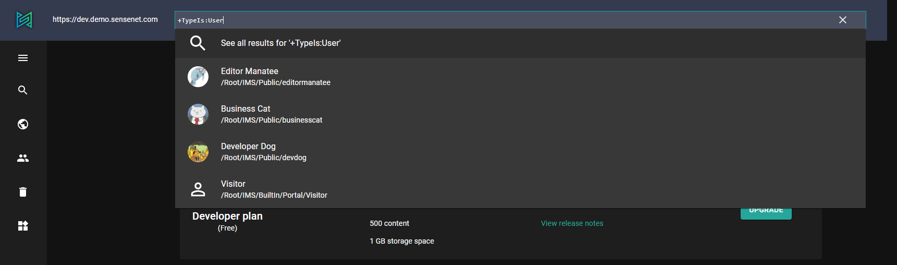

The Command Palette is a flexible tool that allows you to execute operations like navigation, searching or custom actions by simply searching and selecting them. You can activate it with the search icon or with **CTRL+P** keyboard shortcut.

## Navigation between pages

You can navigate between the pages by simply typing a name of a page or the page description.
The available pages are:

- Content
- Search
- Saved queries
- Events

You can open a page by simply clicking on it.

## Search by path

You can search content in the current repository (or the last used one) by starting to type it's path (It should start with '/Root'). You will get a dropdown with the suggestions and open content items by simply clicking on them.

## Search with a content query

You can write [content queries](/concepts/basics/041-content-query/) to search content. The expression should start with a **+** sign. You will get a list of suggestions and an option to open the current expression in the _Search_ view.

## Custom actions

You can execute custom actions on the **active** (last clicked) content. You should open the command palette with the **CTRL+SHIFT+P** keyboard combo or start with a **>** character. The available suggestions will be based on the available content actions.

<note>
If the action accepts parameters, you can provide them in JSON format. You will also get some help with code completion by pressing **CTRL+SPACE**. If the action has a JSON response, you can also preview it.
</note>
