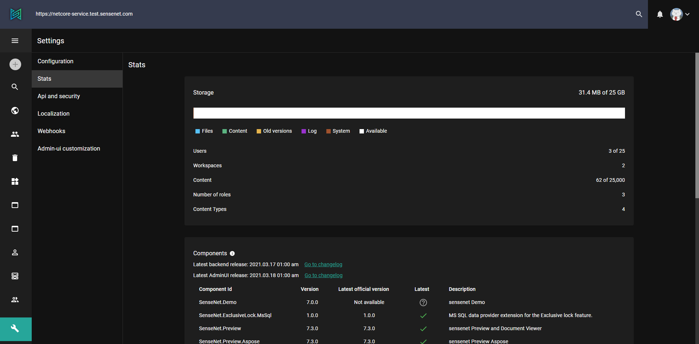

The settings page groups pages for advanced administration tasks. Here you can find detailed information about your content repository (usage, statistics, installed components and the latest release) and manage more advanced things like webhooks, localization files, API keys or system configurations.

The settings page can be reached by clicking the icon at the bottom of the drawer menu of admin-ui.

