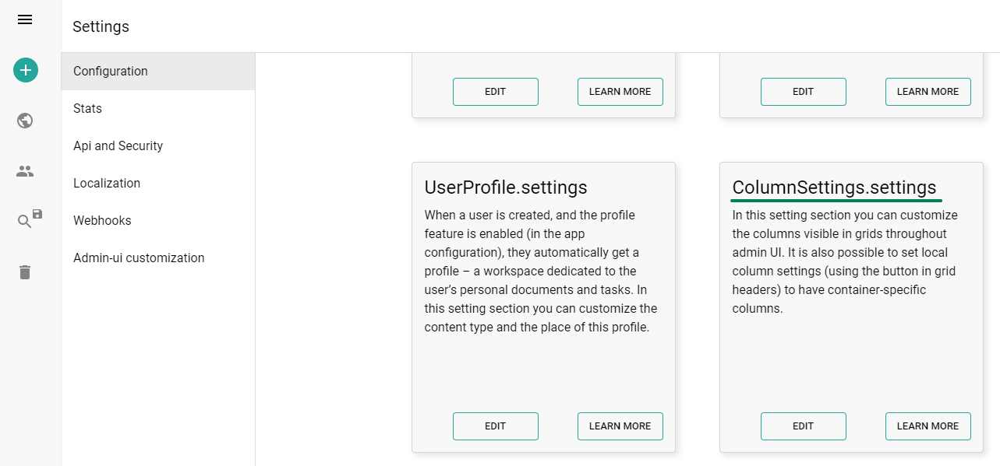
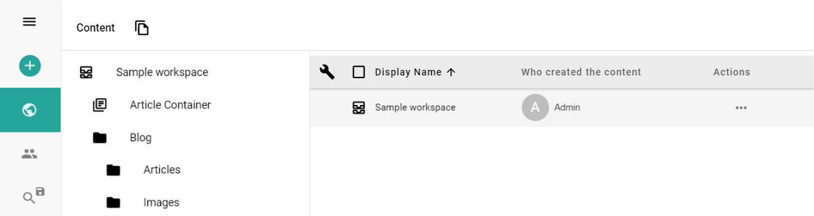
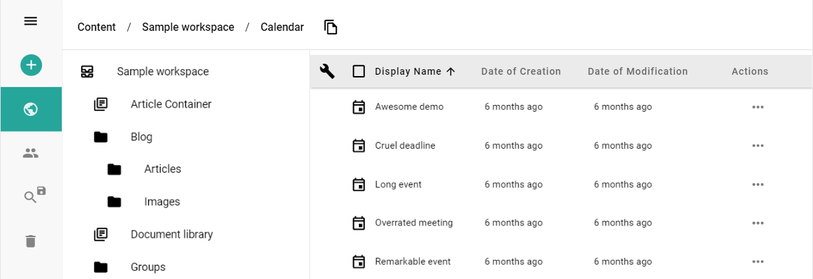

Column Settings is a feature that allows you to configure the displayed columns in Content Explorer. You can set the columns to be displayed in the Content Explorer for a specific content type. You can also set the order of the columns and the title of columns. You can set any field of the content type to be displayed as a column.

Link to settings: https://admin.sensenet.com/settings/configuration/



## How to use

In a JSON File you can declare the desired columns and its titles

```json
{
  "columns": [
    {
      "field": "DisplayName",
      "title": "Display Name"
    },
    {
      "field": "Modified",
      "title": "Who modified the content"
    },
    {
      "field": "Actions",
      "title": "Actions"
    }
  ]
}
```

Once you set the JSON File, the Global setting is ready to use.



## Column Settings for a specific content

You can set the columns to be displayed in the Content Explorer for a specific content. Just simply click on the srewdriver icon on the top left corner of the Content Explorer and edit the JSON File.

for example: You want to set the displayed columns for your Calendar


example:

```json
{
  "columns": [
    {
      "field": "DisplayName",
      "title": "Display Name"
    },
    {
      "field": "CreationDate",
      "title": "Date of Creation"
    },
    {
      "field": "ModificationDate",
      "title": "Date of Modification"
    },
    {
      "field": "Actions",
      "title": "Actions"
    }
  ]
}
```

after you set the JSON File, the local setting is ready to use.


