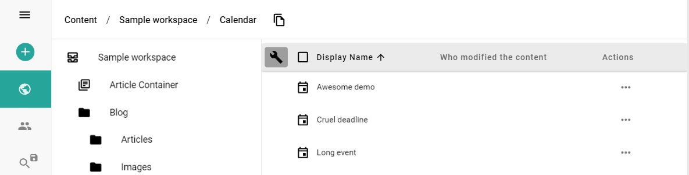

Column Settings is a feature that allows you to configure the displayed columns in admin UI. You can also set the order and the title of the columns. You can show any field of the Content to be displayed as a column.

> If you have a sensenet repository, you can click on this link to go directly to the settings page: https://admin.sensenet.com/settings/configuration


## How to set columns globally
The settings file above controls displayed columns everywhere on admin UI. In this JSON file, you can declare the desired columns and their titles to be displayed.

```json
{
  "columns": [
    {
      "field": "DisplayName",
      "title": "Display Name"
    },
    {
      "field": "CreatedBy",
      "title": "Who created the content"
    },
    {
      "field": "Actions",
      "title": "Actions"
    }
  ]
}
```

Once you set the JSON file and refresh the page, the global setting is ready to use.


## Column setting for specific containers

If you need different fields to be visible in specific containers, simply visit the folder and click on the screwdriver icon and edit the JSON file similar to the global setting. For example, if you want to set the visible columns for your calendar so you can see when calendar items have been created and modified, you can edit the JSON file to include those columns.



Example:

```json
{
  "columns": [
    {
      "field": "DisplayName",
      "title": "Display Name"
    },
    {
      "field": "CreationDate",
      "title": "Date of Creation"
    },
    {
      "field": "ModificationDate",
      "title": "Date of Modification"
    },
    {
      "field": "Actions",
      "title": "Actions"
    }
  ]
}
```

After setting the JSON File, the local setting is ready to use.


## Displaying expanded fields
It is also possible to display fields of referenced content items in the grid. To do that, you have to define columns in the following way:


```json
{
  "columns": [
    {
      "field": "DisplayName",
      "title": "Display Name"
    },
    {
      "field": "CreatedBy/Email",
      "title": "Creator email"
    },
    {
      "field": "Actions",
      "title": "Actions"
    }
  ]
}
```

After setting the columns above, the local grid looks like this:

