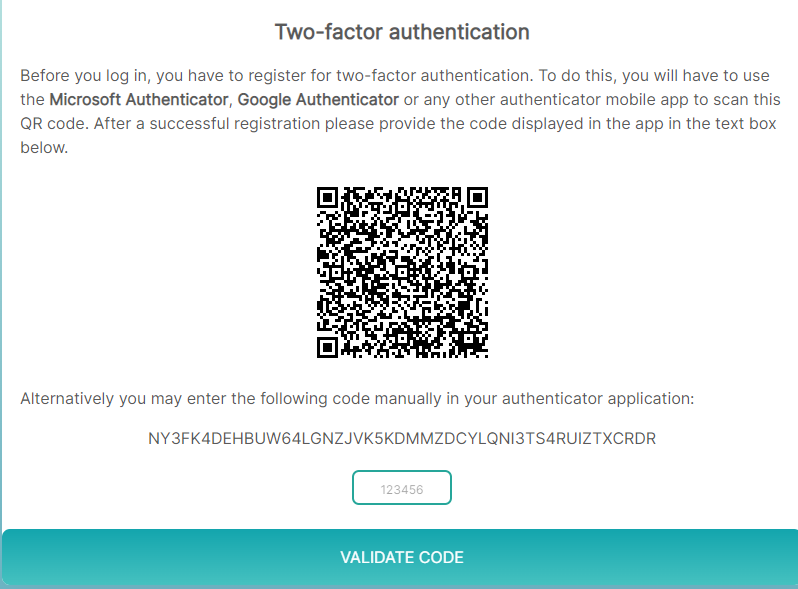

Multi-factor authentication makes the login process more secure by expecting the user to present two or more pieces of evidence (factors). Sensenet supports two-factor authentication by asking the user for an additional code (generated by a separate application) after providing the correct username and password.

> To read more about multi-factor authentication, please head over to [this article](https://en.wikipedia.org/wiki/Multi-factor_authentication).

## Requirements
To use two-factor authentication, users will need to download an **authenticator app** to their mobile phones. The recommended app is one of the following:

- Microsoft Authenticator ([Google Play](https://play.google.com/store/apps/details?id=com.azure.authenticator), [Apple App Store](https://apps.apple.com/us/app/microsoft-authenticator/id983156458))
- Google Authenticator ([Google Play](https://play.google.com/store/apps/details?id=com.google.android.apps.authenticator2), [Apple App Store](https://apps.apple.com/us/app/google-authenticator/id388497605))
- or any trusted authenticator app that supports the 2FA standard

## System-wide setting
By default two-factor authentication is optional. This means users may decide whether they want two-factor authentication (2FA) for themselves. To change this, you can visit the `MultiFactor Authentication` settings page in admin UI and set the `MultiFactorAuthentication` value to one of the following:

- **Optional** (default): users can set up 2FA for themselves if they want
- **Forced**: per-user switch does not matter, everybody has to use 2FA
- **Disabled**: per-user switch does not matter, nobody can use 2FA (use this only in technical cases)

## Enabling two-factor authentication for a user
If the feature is enabled globally, users can switch it on on their profile page by setting the `MultiFactor authentication enabled` switch. Administrators with Save permission on the user may also edit this on behalf of the user.

## Logging in
When the feature was switched on and the user tries to log in for the first time, they will still need to enter their _username_ and _password_ first. After successfully verifying that, they will be presented a QR code:

After scanning the QR code with the app, it will register an account for this sensenet application and user. The code displayed by the application lives for a short time. The user has to enter this code within the time frame configured by the administrators of the repository.

When a user enters the correct code on the page above, sensenet registers this and logs in the user. When the user tries to log in **next time, they will only see the code box, not the QR code**.

> Users need to make sure they protect their phone and can provide the current code displayed by the authenticator app every time they log in  - otherwise the system will not let them in.

## Resetting the code
If the user is not able to present the 2FA code during log in (for example because they switched to a different phone), they can ask an administrator to switch 2FA off temporarily on their profile using the flag mentioned above.

Switching the `MultiFactor authentication enabled` flag off and on (and saving the user in between) effectively resets the generated secret key and lets the user log in again using their username and password and then register a new QR code in their app again.

> Switching to a new phone should not be an issue anymore as some authenticator apps offer a cloud synch feature that will let the user continue using the same registration on a new phone.
