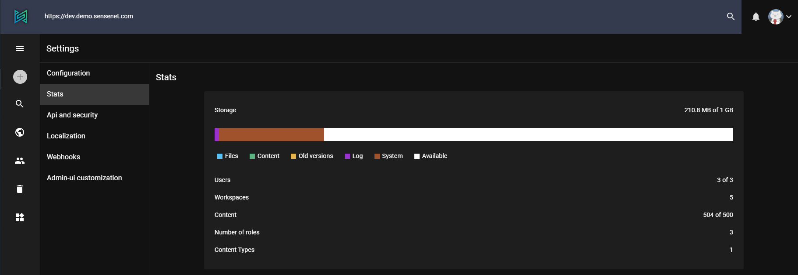
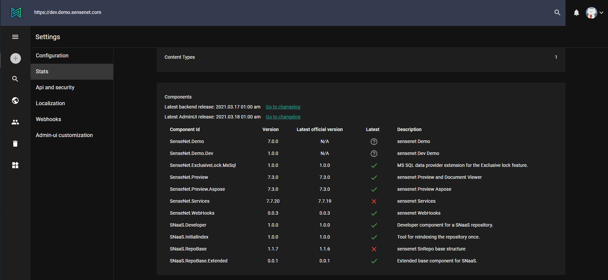
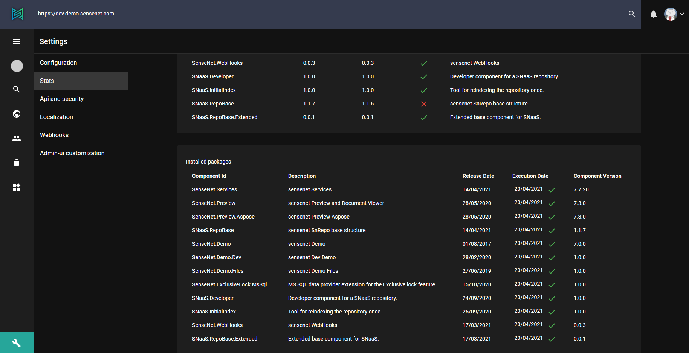

Stats page contains all the important statistics and information about your sensenet repository.

## Storage

A sensenet content repository allows you to store and manage all your content for different solutions in one place. Since everything is a content in the same repository, configuration files, content types and templates all of these will decrease your available space in the storage. The available space depends on your subscription plan which can be a Developer plan, Business plan or a personalized enterprise plan.

In the first box of **Settings / Stats** page you can see details of your repository storage space. The diagram shows you for example how many users are in your repository or how much space the logs take up.

## Components

The components part lists the dates of the latest releases and you can easily go to the release notes by clicking them.
Below the links a table shows you the installed components of your sensenet with their actual and latest versions, so you can make sure that your repository is up-to-date.
These components may include one or more packages.

## Installed packages

The next box provides you information about installed packages. These packages are mainly the building blocks of sensenet components. There are also tool-like packages that are not part of the component structure, they were made to run multiple times, for example to delete or index content.
In the table you can find the package's release date, execution date which indicates the date of last update and the date of installation. The icon next to execution date tells you if the installation was successful (green tick) or not (red X). The last column contains the version of the actual package.

