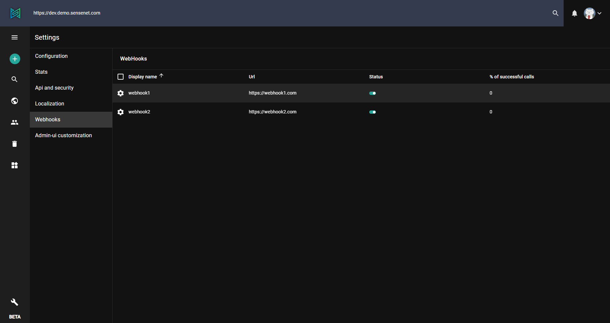
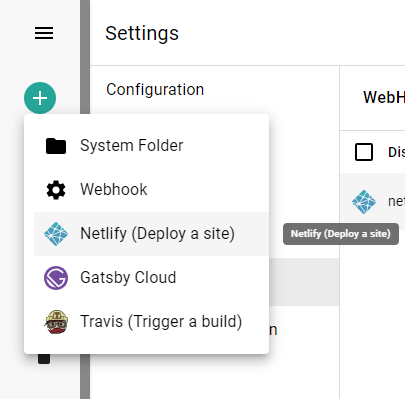

> Webhooks are essential tools in a modern enterprise development scenario, especially when multiple microservices need to communicate efficiently.
> They allow developers to react to events occurring within a service without executing code directly inside that service.

To understand the basic concepts of webhooks in sensenet, please refer to [this article](/concepts/webhooks).

## Webhook Subscriptions

The sensenet admin UI allows you to manage webhook subscriptions under **Settings / Webhooks**.

### Viewing and Managing Webhooks

On the main page, you can see existing webhook subscriptions. Since everything in sensenet is treated as content, webhook subscriptions can be viewed, edited, or deleted like any other content type.

### Webhook Subscription Properties

When browsing or editing a webhook subscription, you will find the following fields:

| Property      | Description |
|--------------|-------------|
| **Status**   | Temporarily suspend a webhook by switching it off in the list. |
| **Name**     | The name of the webhook subscription. |
| **HTTP Method** | Choose the HTTP method (GET, POST, PUT, etc.) to use when calling the target service. |
| **URL**      | The endpoint to send the webhook request when an event is triggered. |
| **Triggers** | Define which content types and event triggers should activate the webhook. |
| **Headers**  | Specify custom HTTP headers to include in the request. |
| **Payload**  | The data payload sent when an event is triggered. |

#### Example: Creating a Webhook Subscription

1. Navigate to **Settings / Webhooks** in the admin UI.
2. Click **Create New Webhook Subscription**.
3. Configure the webhook by setting:
   - **Name**: `NewContentWebhook`
   - **URL**: `https://your-service.com/webhook-handler`
   - **HTTP Method**: `POST`
   - **Triggers**: Monitor `Documents` for `Created` events.
   - **Headers**: Add `Authorization: Bearer <your-token>` if required.
   - **Payload**: Include relevant data, e.g., `{"contentId": "{Id}", "title": "{Name}"}`
4. Save the webhook and test it manually (explained below).

## Webhook Templates

sensenet provides built-in webhook templates for popular service providers like Netlify and Heroku. Each template includes predefined fields and logic required for sending notifications to external services.

Check the available webhook templates in the [integrations documentation](/integrations/webhook).

## Triggering a Webhook Manually

You can manually trigger a webhook to validate its configuration:

1. Open the **webhooks list**.
2. Select the webhook you want to test.
3. Open the **command palette** using `CTRL+SHIFT+P`.
4. Search for `FireWebHook`.
5. Choose an action (based on parameters like path or ID).
6. Add the required parameters and execute the action.

## Testing Webhooks

### Using Beeceptor

Beeceptor allows you to test webhook calls without setting up a server. To test your webhook:

1. Go to [Beeceptor](https://beeceptor.com/).
2. Create a new endpoint (e.g., `https://mywebhook.beeceptor.com`).
3. Update your sensenet webhook URL to the Beeceptor endpoint.
4. Trigger the webhook and inspect the received request in Beeceptor's dashboard.

### Using Webhook.site

Webhook.site is another alternative for testing incoming webhook requests:

1. Open [Webhook.site](https://webhook.site/).
2. Copy the unique generated URL.
3. Configure your sensenet webhook to send data to this URL.
4. Trigger the webhook and view the request details in real time.

These tools help you debug webhook payloads and ensure your configuration works before integrating with production services.

For more details on subscribing to webhooks and handling incoming requests in sensenet, refer to [this tutorial](/tutorials/webhooks).
