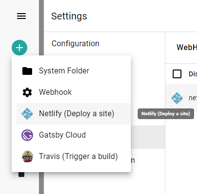

> Webhooks are essential tools in a modern enterprise development scenario, when we work in an environment where many micro-services have to connect to each other.
> Webhooks let developers react to events that may happen inside a service - but without having to execute code directly inside that service.

To learn the basic concepts of webhooks in sensenet, please [visit this article](/concepts/webhooks).

## Webhook subscriptions

The admin ui of sensenet allows you to subscribe to webhooks and see or edit the already created subscriptions under **Settings / Webhooks**.

On the main page you can see the existing subscriptions. Since everything is a content in sensenet you can see/edit/delete webhook subscriptions like any other content.

 The browse and edit view is a little bit different than in case of other contents:

 **Status**: It is possible to temporarily suspend a subscription by switching it off in the list.

 **Name**: The name of your webhook subscription

 **Http method**: sensenet offers you to choose the HTTP method to use when calling the target service.

 **Url**: This is the URL of the service to call when an event triggers the webhook.

 

 **Triggers**: It contains a container where you want to monitor content items and one or more specific content types and event triggers.

 **Headers**: You have the option to add custom HTTP headers to the request.

 

**Payload**: This is the data we send when an event is triggered

 

To learn how can you subscribe to webhooks and how can you handle the requests sensenet makes [visit this article](/tutorials/webhooks).

## Webhook templates

sensenet provides you some built-in webhook templates to work with your favorite other service providers like Netlify or Heroku. Every template is a specific webhook subscription content with some custom fields and background logic that are needed to be filled and made when you send notifications to the related external service. Check the currently available webhook templates in the [integrations docs](/integrations/webhook).

 

## Trigger a webhook manually

It is possible to trigger webhooks manually to try out if all the settings fit your needs. Select the webhook in the webhooks list and open command palette search with CTRL+SHIFT+P. Search for the *FireWebHook* and choose an action from the list based on what parameters you want to test with (path or id). Add the required parameters and execute the action.
