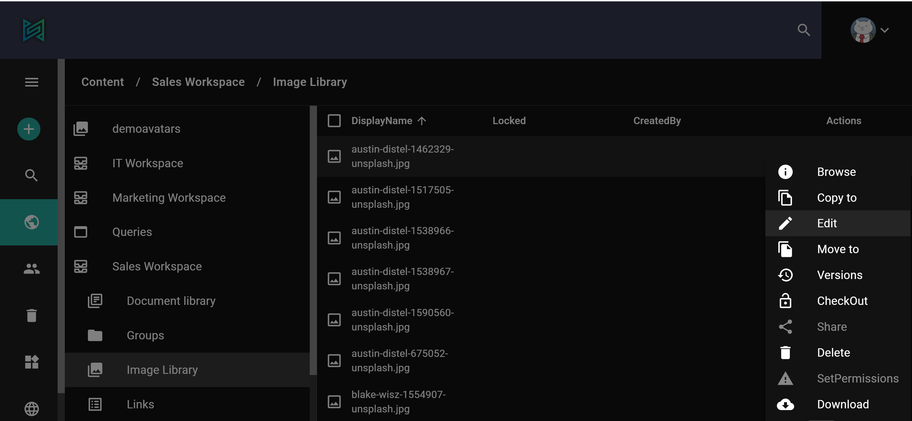

By selecting the _Setup_ option from the left side menu you can customize different settings rigth on the admin-ui.
Here you can modify for example *Portal settings*, *Indexing*, *OfficeOnline Settings* and so on.

In sensenet we differentiate local and global settings.
Global settings can be set in the setup menu, local ones in the other hand on a specific file or folder fox example.
Watermark can be set globally in *DocumentPreview.Settings.* resulting that each and every preview image will have the same watermark.

In addition to that, you can define different watermarks for different workspaces (which will then overwrite global settings), or even set watermark to a specific doclib. 
Watermark is just one example of how versatile settings in sensenet can be, mainly due to the hierarchical tree structure, which forms the base of our content repository.

