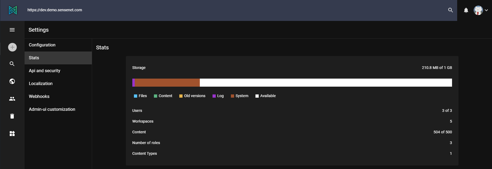
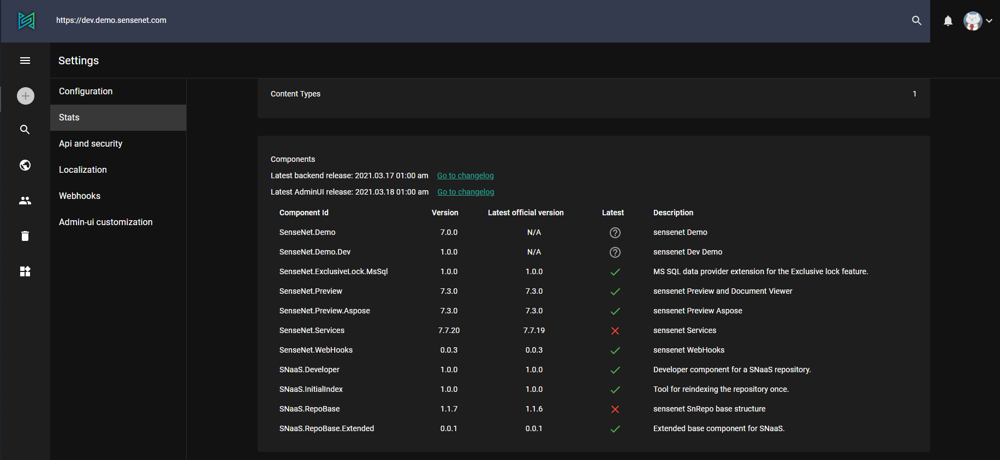
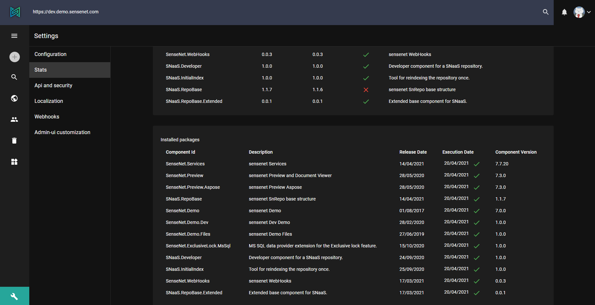

Stats page contains all the important info about your sensenet repo.

*Storage*

A sensenet content repository allows you to store and manage all your content for different solutions in one place. Since everything is a content in the same repository, configuration files, content types and templates all of these will decrease your available space in the storage. The available space depends on your plan which can be a Developer plan, Business plan or a personalized enterprise plan.

In the first box of **Settings / Stats** page you can see your repository space break into details. This diagram tells you for example how many users are in your repository or how much space the logs take up.

*Components*

The components part contains the latest dates of the releases and you can easily navigate to the release notes with the links next to the dates.
Below that the table show you the components of your sensenet with the actual and latest versions, so you can make sure if your sensenet is up-to-date.
A component can consist of several packages, but there is also possible that a component is from only a single package.

*Installed packages*

Installed packages box provide you all the information about packages. These packages make up the components of sensenet. There can also be packages that are not involved in the structure of the components, such as a tool-type package designed to run multiple times, for example deleting content or indexing.
In the table you can find the release date, execution date which indicates the date of last modfication and the date of installation. The icon next to execution date tells you if the installation was successful (green tick) or not (red X). The last column contains the version of the actual package.
If one of the installation of the package was successful (e.g.: version 1.0.0) and another one (e.g.: 1.0.1) was not, you can find both rows in the table. But after another succcessful install of the version of 1.0.1 this will overwrite the previous, so there will be only one row with the version of the latest successful install (1.0.1).

