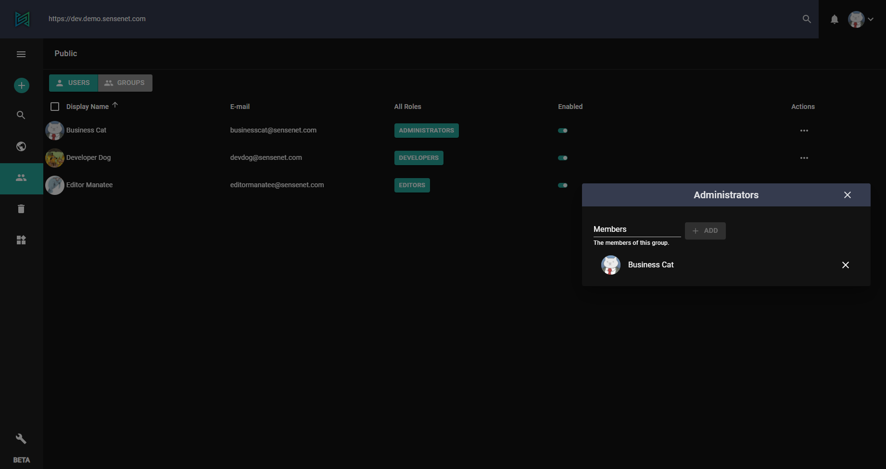
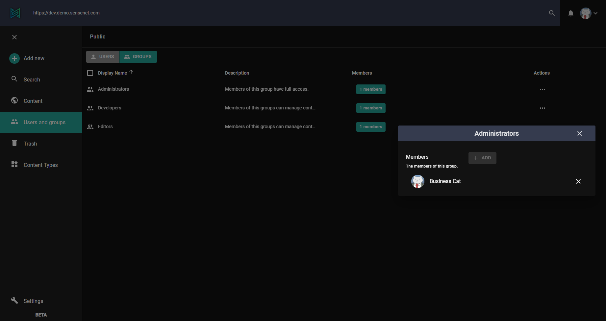
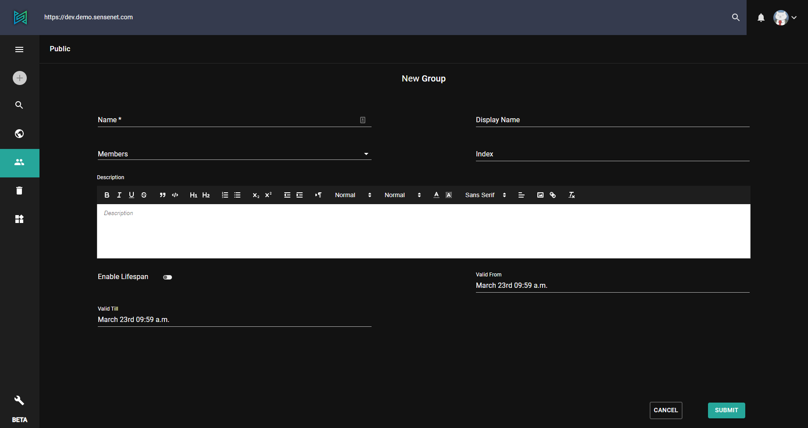

User and groups can be managed on the admin-ui in a dedicated section. Here you can add new user, organize them in groups and edit items one by one.

<note>
users and groups can be sorted by clicking the column titles
</note>

# Users

Since user management differs from group management (columns, actions etc.) admin-ui contains two different views. You can switch between them by using the selector at the top.

In *USERS* tab the following columns are displayed:

- Display name
- Email
- Roles - this column lists all groups the user is member of
- Enabled - if a specific user is disabled, it cannot log in to the system
- Actions - basic actions (Browse, Copy, Edit or Move user)

<note>
By clicking a role you can manage members of that specific group.
</note>

To create a new user, just click on the *Add new* button and select *User* then fill the fields of the new item. If you want, you can add an avatar as well so the user can be recognized more easily on different views (avatar can appear in created by or modified by columns for example).
Mandatory fields are always marked with an asterisk*. Without filling these fields you won't be able to submit the new user.

# Groups

*GROUPS* tab is slightly different. It contains the following:

- Display name - like on *USERS* tab
- Description - a simple long text field
- Members - shows how many member a specific group contains
- Actions - basic actions (Browse, Copy, Edit or Move user)

In *Members* column you can see the total number of members of each group and you can also manage them by clicking on it.

To create a new group, just click on the *Add new* button and select *Group* then fill the fields of the new item.
Mandatory fields are always marked with an asterisk*. Without filling these fields you won't be able to submit the new group.

# Organizational unit

An organizational unit is basically a container item for both users and groups. It can be used to organize items (groups and users) in different "categories" to easily keep track of things on the long run. After a new org. unit is created, it appear as in the tree of the users and groups section. You can create or move new items here.

<note>
new organizational unit can be created the same way as a user or group
</note>

