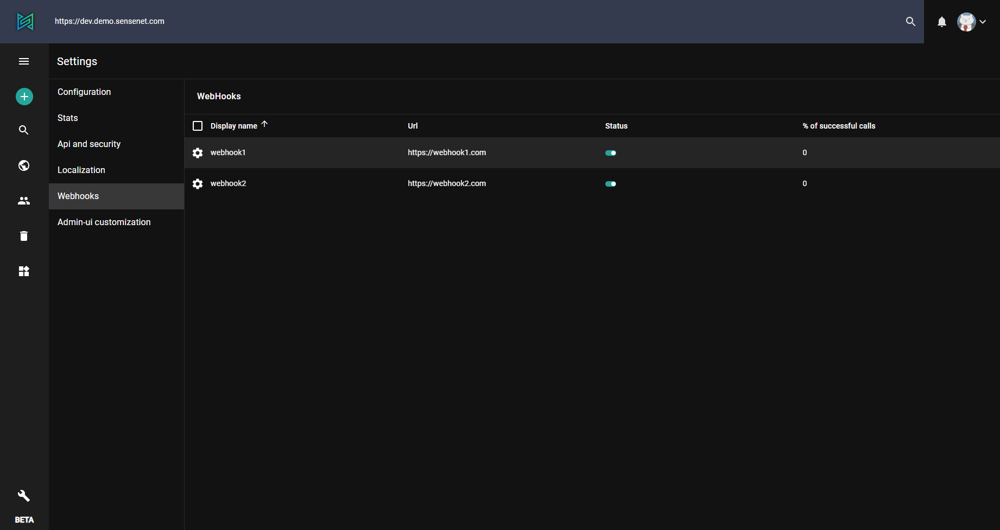
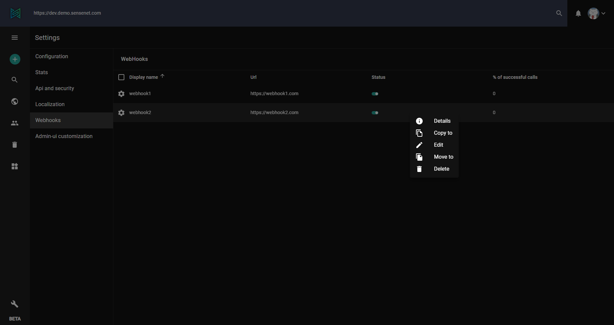
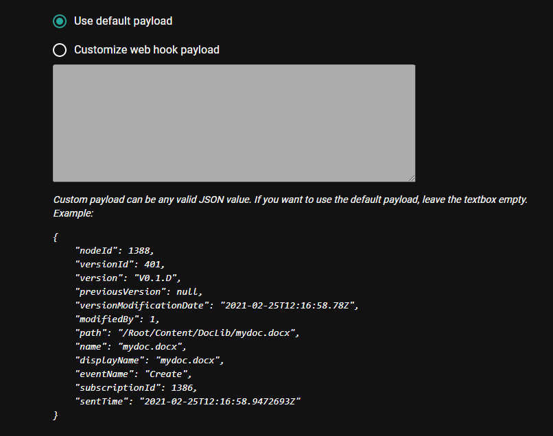

> Webhooks are essential tools in a modern enterprise development scenario, when we work in an environment where many micro-services have to connect to each other.
> Webhooks let developers react to events that may happen inside a service - but without having to execute code directly inside that service.

To learn the basic concepts of WebHooks in sensenet, please [visit this article](/concepts/webhooks).

The admin ui of sensenet allows you to subscribe to webhooks and see or edit the already created subscriptions under **Settings / Webhooks**.

On the main page you can see the existing subscriptions. Since everything is a content in sensenet you can see/edit/delete webhook subsriptions like any other content.

 The browse and edit view is a little bit different than in case of other contents:

 _Status:_ It is possible to temporarily suspend a subscription by switching it off in the list.

 _Name:_ The name of your webhook subscription

 _Http method:_ sensenet offers you to choose the HTTP method to use when calling the target service.

 _Url:_ This is the URL of the service to call when an event triggers the webhook.

 

 _Triggers:_ It contains a container where you want to monitor content items and one or more specific content types and event triggers.

 _Headers:_ You have the option to add custom HTTP headers to the request.

 

_Payload:_ This is the data we send when an event is triggered

 

To learn how can you subscribe to webhooks and how can you handle the requests sensenet makes [visit this article](/tutorials/webhooks).
