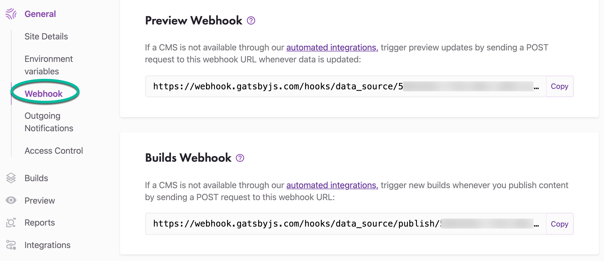
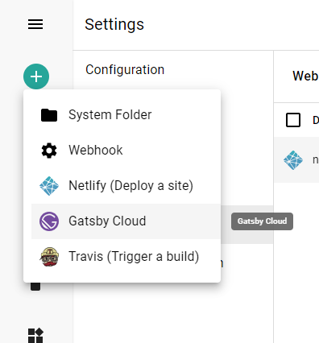
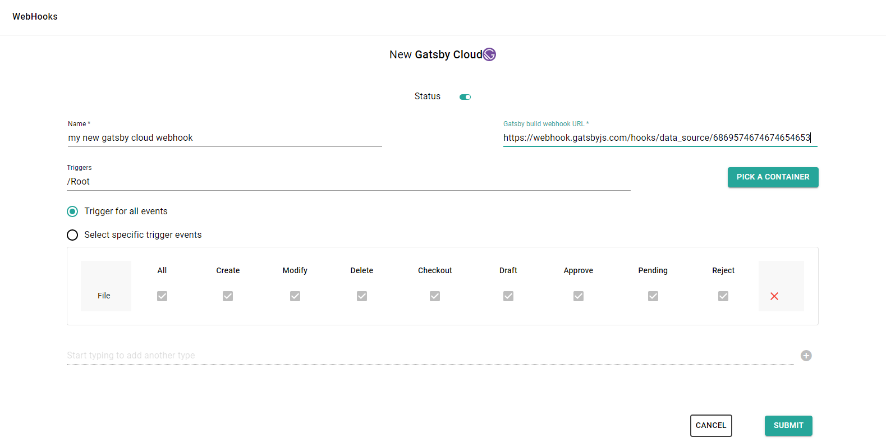

# What are Gatsby Cloud and sensenet, and why use them together?

[sensenet](https://www.sensenet.com/) is a headless CMS that content editors can use to edit and publish content. Gatsby Cloud allows you to integrate your site with sensenet in order to run performant builds and preview content changes made in the CMS before publishing.

# Setting up sensenet and Gatsby site

First, you’ll need a Gatsby site with a [gatsby-source-sensenet](https://www.gatsbyjs.com/plugins/gatsby-source-sensenet/) source plugin pulling data from sensenet. It should be stored in a GitHub repository. If you haven’t set that up yet, you can quickly create a new project by using the [sensenet-gatsby-starter](https://github.com/SenseNet/gatsby-starter-sensenet-blog) and signing up for an account at sensenet.com.

# Signing in to Gatsby Cloud

Select Sign in with GitHub. You’ll be asked to authorize the Gatsby Cloud app with your GitHub account. If you need to request access to one or more repositories, you can click “request access” here or later, when creating an instance.

Once signed in, configuring Gatsby Cloud with sensenet requires several steps that are walked through below.

# Setting up Environment Variables

In Gatsby Cloud, start creating a site using the [Import from a Repository flow](https://support.gatsbyjs.com/hc/en-us/articles/360059253654). Once you reach step 5, "Configure Environment Variables," you can add your build environmental variables. GATSBY_REACT_APP_CLIENT_ID and GATSBY_REACT_APP_CLIENT_SECRET are recommend to use as environmental variables and if you have used others anywhere else you may need to add them as well.

# Webhooks

The next step is going to the webhook settings for your Gatsby Cloud site. Navigate to **Site setting > General > Webhook**

On sensenet admin ui choose Gatsby Cloud template when you add a new webhook:

There are two required fields on the form to fill out: _Name_ and _Gatsby build webhook URL / Gatsby preview webhook URL_ (the urls mentioned above at Gatsby Cloud site settings). You can leave all other fields at default (you can change them at any time later) and thats it.

By default, this webhook will:

- Trigger a Gatsby Cloud build/preview
- Triggered when something is happened with a **File** under **/Root**
- Triggered on all available events (Create, Modify, Delete, Checkout, Draft, Approve, Pending, Reject)

<note severity="info">For additional setting options check <a href="../../guides/webhooks">webhook guide docs</a>.</note>

It is possible to trigger webhooks manually to try out if all the settings fit your needs. Select the webhook in the webhooks list and open command palette search with CTRL+SHIFT+P. Search for the _FireWebHook_ and choose an action from the list based on what parameters you want to test with (path or id). Add the required parameters and execute the action.
