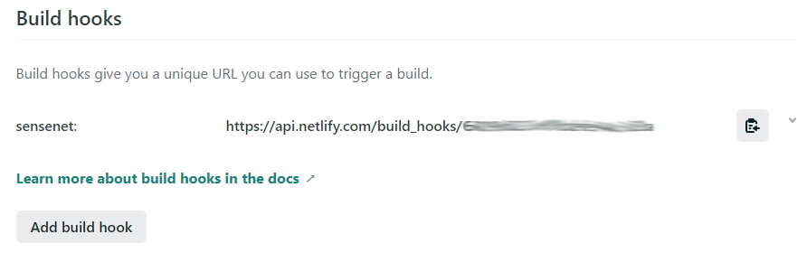
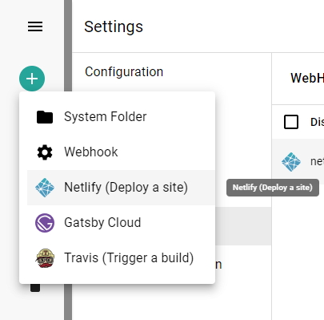
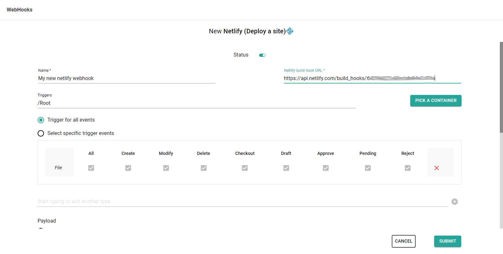

With this template you can easily create webhooks that notify projects hosted on Netlify about the chosen content related events (creation, change, approval, etc.), automatically triggering a build to deploy a new version of the app.

First, go to your Netlify site and create a build hook for sensenet (it can be found under Site > Site settings > Build & Deploy > Build hooks)

On sensenet admin ui choose Netlify template when you add a new webhook:

There are two required fields on the form to fill out: *Name* and *Netlify build hook URL* (the url you've created above at Netlify Build and Deploy page). You can leave all other fields at default (you can change them at any time later) and thats it.

By default, this webhook will:

- Trigger a Netlify build
- Triggered when something is happened with a **File** under **/Root**
- Triggered on all available events (Create, Modify, Delete, Checkout, Draft, Approve, Pending, Reject)

<note severity="info">For additional setting options check <a href="/guides/webhooks">webhook guide docs</a>.</note>

It is possible to trigger webhooks manually to try out if all the settings fit your needs. Select the webhook in the webhooks list and open command palette search with CTRL+SHIFT+P. Search for the *FireWebHook* and choose an action from the list based on what parameters you want to test with (path or id). Add the required parameters and execute the action.

