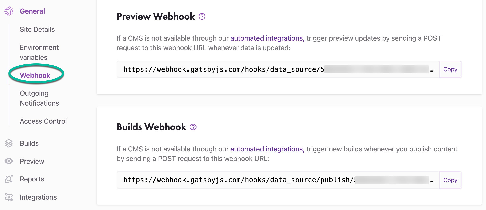
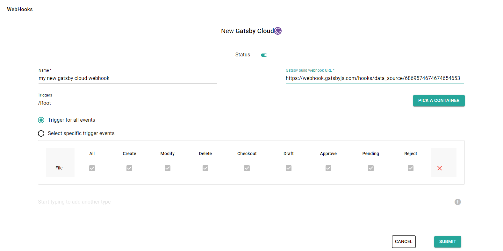

With this template you can easily create webhooks that notify your site on Gatsby Cloud about the chosen content related events (creation, change, approval, etc.), automatically triggering a build to deploy a new version of the site.

First, go to your Gatsby Cloud and get the *Build webhook* (it can be found under Site setting > General > Webhook)

On sensenet admin ui choose Gatsby Cloud template when you add a new webhook:

There are two required fields on the form to fill out: *Name* and *Gatsby build webhook URL* (the url mentioned above at Gatsby Cloud site settings). You can leave all other fields at default (you can change them at any time later) and thats it.

By default, this webhook will:

- Trigger a Gatsby Cloud build
- Triggered when something is happened with a **File** under **/Root**
- Triggered on all available events (Create, Modify, Delete, Checkout, Draft, Approve, Pending, Reject)

<note severity="info">For additional setting options check <a href="/guides/webhooks">webhook guide docs</a>.</note>

It is possible to trigger webhooks manually to try out if all the settings fit your needs. Select the webhook in the webhooks list and open command palette search with CTRL+SHIFT+P. Search for the *FireWebHook* and choose an action from the list based on what parameters you want to test with (path or id). Add the required parameters and execute the action.
