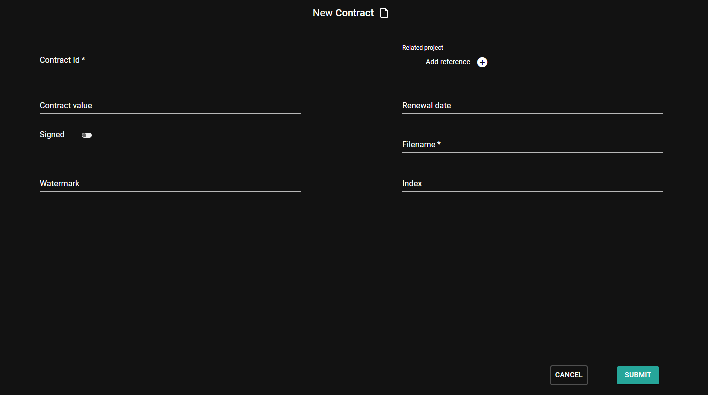

A Content Type Definition (CTD) is an XML-format configuration file for content types. After creating a new CTD the content type is immediately available in the system and can be used to create new content. The XML configuration (CTD) holds information about the content's name, description, icon, its parent content type's name and fields for storing content metadata.

# Create a new content type definition

First login to the admin-ui and go to the Content Types menu. There you can find all the available content types, built-in and the custom ones as well. Choosing an existing content type to be your custom's parent type is a key step of creating content types in sensenet. It can save you a lot of headaches if you choose a parent type with fields and logic which you will need in your custom type anyway.

Let's see how to create a custom type for contracts. Contracts are in most of the cases files with some specific metadata like multiple unique contract id's, a connected project or lawyer name and related other documents as references. But behind these contract-specific data they are files that should have all the common metadata like the actual binary of the file, date of modification, creator user and so on. These are the cases when sensenet's content type inheritance comes handy. All you have to do is to choose the right parent type and create an inherited one to get all the common fields that a file typed content should have.

Click on the add button at the top of the drawer menu and choose Content Type from the dropdown. A xml editor will appear with some default data to help you at the start. Don't panic, working with these xml files seems to be though at the beginning, but you cannot spoil anything and if you made one, the others will come easy.

You can clear the content of the editor and paste the following xml instead:
```xml
<ContentType name="Contract" parentType="File" handler="SenseNet.ContentRepository.File" xmlns="http://schemas.sensenet.com/SenseNet/ContentRepository/ContentTypeDefinition">
  <DisplayName>Contract</DisplayName>
  <Description>Type for agreement documents</Description>
  <Icon>File</Icon>
  <Fields>
  <Field name="ContractId" type="ShortText">
    <DisplayName>Contract Id</DisplayName>
    <Description>Unique contract Id needed for example for legal proceedings</Description>
    <Configuration>
      <MaxLength>30</MaxLength>
      <MinLength>10</MinLength>
      <Regex>[a-zA-Z0-9]*$</Regex>
      <Compulsory>true</Compulsory>
    </Configuration>
  </Field>
  <Field name="RelatedProject" type="Reference">
    <DisplayName>Related project</DisplayName>
    <Description>Project to which the contract relates</Description>
    <Configuration>
      <AllowMultiple>false</AllowMultiple>
      <AllowedTypes>
        <Type>ProjectWorkspace</Type>
      </AllowedTypes>
    </Configuration>
  </Field>
  <Field name="ContractValue" type="Number">
    <DisplayName>Contract value</DisplayName>
    <Description>Value of the contract</Description>
    <Configuration>
      <Digits>2</Digits>
    </Configuration>
  </Field>
  <Field name="RenewalDate" type="DateTime">
    <DisplayName>Renewal date</DisplayName>
    <Description>The date of renewal of the contract</Description>
  </Field>
  </Fields>
</ContentType>
```

See followings to understand what is happening here:

```<ContentType name="Contract" parentType="File"..>```

You've created a content type named Contract that is inherited from the built-in type File. That means that all the fields and configurations from parent type File are available on Contract type as well (in the next paragraph you can see which are these) and you have to define only those fields that are required on Contract and are not part of File's fieldset.

```xml
...
  <DisplayName>Contract</DisplayName>
  <Description>Type for agreement documents</Description>
  <Icon>File</Icon>
...
```

In the head part of the CTD we define key descriptive things that will be used on various places on the UI where we will use the type itself.


<div>&nbsp;</div>


<note severity="info">For more information about the content types and content type definitions check the <a href="/concepts/content-management/03-content-types">concepts</a></note>

The other main part of a CTD is the list of unique fields and their configurations. Unique means fields that are not related to common files and are not defined on the built-in File type. Fields are always listed between the `<Fields>` tag.

In the example above you can see that we've created four fields that will be available on Contracts additionally.

```xml
...
<Field name="ContractId" type="ShortText">
    <DisplayName>Contract Id</DisplayName>
    <Description>Unique contract Id needed for example for legal proceedings</Description>
    <Configuration>
      <MaxLength>30</MaxLength>
      <MinLength>10</MinLength>
      <Regex>[a-zA-Z0-9]*$</Regex>
      <Compulsory>true</Compulsory>
    </Configuration>
</Field>
...
```

ContractId is a text field for setting a unique identifier which does not match the content Id. Its value could be a simple text of letters and numbers (`Regex`), its length should be between 10 and 30 characters (`MinLength` and `MaxLength`) and it is required to fill it (`Compulsory`).

<note severity="info">Find ShortText field's setting and configuration options in the <a href="/concepts/fields/03-shortext">concepts</a></note>

```xml
  <Field name="RelatedProject" type="Reference">
    <DisplayName>Related project</DisplayName>
    <Description>Project to which the contract relates</Description>
    <Configuration>
      <AllowMultiple>false</AllowMultiple>
      <AllowedTypes>
        <Type>ProjectWorkspace</Type>
      </AllowedTypes>
    </Configuration>
  </Field>
```

Next one is a reference field to connect a project to the contract. Only one project can be assigned (`AllowMultiple`) and the linked content can only be of ProjectWorkspace type (`AllowedTypes`)

<note severity="info">Find Reference field's setting and configuration options in the <a href="/concepts/fields/09-reference">concepts</a></note>

```xml
  <Field name="ContractValue" type="Number">
    <DisplayName>Contract value</DisplayName>
    <Description>Value of the contract</Description>
    <Configuration>
      <Digits>2</Digits>
    </Configuration>
  </Field>
```

ContractValue is a number field to hold value of the contract. The value's displayed decimals could be two (`Digits`).

<note severity="info">Find Number field's setting and configuration options in the <a href="/concepts/fields/06-number">concepts</a></note>

```xml
 <Field name="RenewalDate" type="DateTime">
    <DisplayName>Renewal date</DisplayName>
    <Description>The date of renewal of the contract</Description>
  </Field>
```

The last one is a DateTime type field to contain the renewal date of the contract.

<note severity="info">Find DateTime field's setting and configuration options in the <a href="/concepts/fields/10-datetime">concepts</a></note>


# Create content with the new type

After creating a new content type you need to set where you want to use it. List of allowed child types lets you assemble the group of content types that can be used in a container or a subtree. To do this, go to the chosen container and open it for edit and update the content's *Allowed Child Types* field adding your newly created one.


After that, Contract will be available as type of new content in the dropdown list.


# Inherited fields

As it is mentioned above all the fields that are defined on parent types are available on the lower levels. So on your newly created Contract type all the fields from File (parent type) and GenericContent (parent type of file) is there and you can get and set their values through OData or make them visible on the UI along with the custom ones defined by you. If you now start to create a new contract you can see that the form contains not only those fields, but also those that you've added to the custom type.


# Change your content type

You can change content types at any time later, regardless of whether you have already created content with it. You can update or delete an existing field, add a new one or modify basic type infos (DisplayName, Icon).

<note severity="error">Parent type of a content type cannot be changed, because it would mess up inheritance and the type tree!</note>
<div>&nbsp;</div>
<note severity="info">If you change the name of the type, a new content type is created and the old one with the previously used name also remains</note>

# Working with field visibility

Sometimes fields you've added become unnecessary to fill out or it can even occur with inherited fields. In this cases you don't have to remove the field completely (this way you can keep the data), you can hide them instead. All the fields have field visibility configuration options so you can specify which field to display in which view. There are three main views (Browse, New and Edit) that are used in different scenarios. For example in this case you want to hide the inherited fields (EnableLifeSpan, ValidFrom and ValidTill) from the new form which is shown when a user creates a new contract. Add the following code to the Contract CTD before the closing `</Fields>` tag.

```xml
<Field name="EnableLifespan" type="Boolean">
  <Configuration>
    <VisibleNew>Hide</VisibleNew>
  </Configuration>
</Field>
<Field name="ValidFrom" type="DateTime">
  <Configuration>
    <VisibleNew>Hide</VisibleNew>
  </Configuration>
</Field>
<Field name="ValidTill" type="DateTime">
  <Configuration>
    <VisibleNew>Hide</VisibleNew>
  </Configuration>
</Field>
```

As you can see you only need to list the fields and override one visibility config per field. After that update, the fields we wanted to hide are not seen anymore on the contract creation form.


In this case adding this three fields to the content type does not mean you've created totally new fields. These fields will be handled as updated ones which can be done based on the fact that the name and type pairs of a field should be unique helping the type system identify fields to update.

<note severity="info">Learn more about field visibility in the <a href="/concepts/fields/10-datetime">concepts</a></note>

# Add a new field

Of course you can add new fields to any type, but only by adding them with a unique name. If a field with a same name exists in the system there are two possible outcomes: if a field with a same name and type exists in the schema, the modifications will override the existing field configuration, if a field with the same name exists but with a different type, you will not be able to save the CTD.

To try out new field creation, add the following field definition before the closing `</Fields>` tag.

```xml
<Field name="IsSigned" type="Boolean">
  <DisplayName>Signed</DisplayName>
</Field>
```

As you see the new field is a simple boolean field to store whether the contract has already been signed.



# Modify fields

You may want to change a field and its configuration for many reasons: to change order of the fields, their visibility and so on. Every aspect of a field could be modified except one, the type. Fields have various configurations and settings per type. To learn more about a specific field type's possible configurations check the [concept docs](https://docs.sensenet.com/concepts/fields).

To try out modification add a default value to the *Contract value*. Update the field definition with the following configuration:

```xml
<Field name="ContractValue" type="Number">
    <DisplayName>Contract value</DisplayName>
    <Description>Value of the contract</Description>
    <Configuration>
      <Digits>2</Digits>
      <DefaultValue>100</DefaultValue>
    </Configuration>
  </Field>
```

Now, when you create a new contract the value field will be automatically filled with the default value.


# Delete a field

To actually delete a field, we need to delete it from the CTD where it is basically defined. So for example if we want to delete `EnableLifespan` field system-wide, we have to remove it from the `GenericContent` type. It is easier if we are working with custom content types, because the non-inherited custom fields could be easily removed from these.

<note severity="error">When you remove a field from a CTD, we delete all the values for that field immediately from the database, so please be careful about it! On the other hand, content are not reindexed (it would take too much time), which means you will still be able to find content by their previous field value using a content query - even after that field has been removed from the CTD.</note>

<div>&nbsp;</div>
