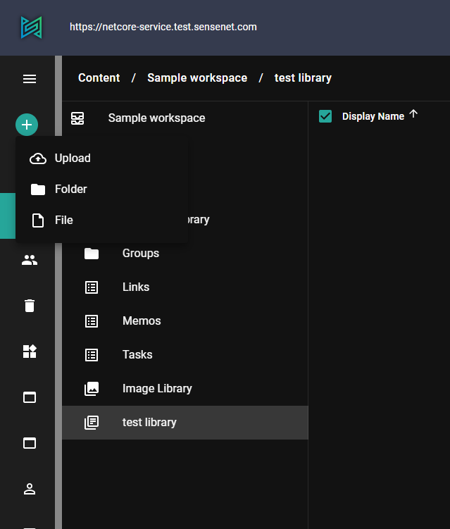
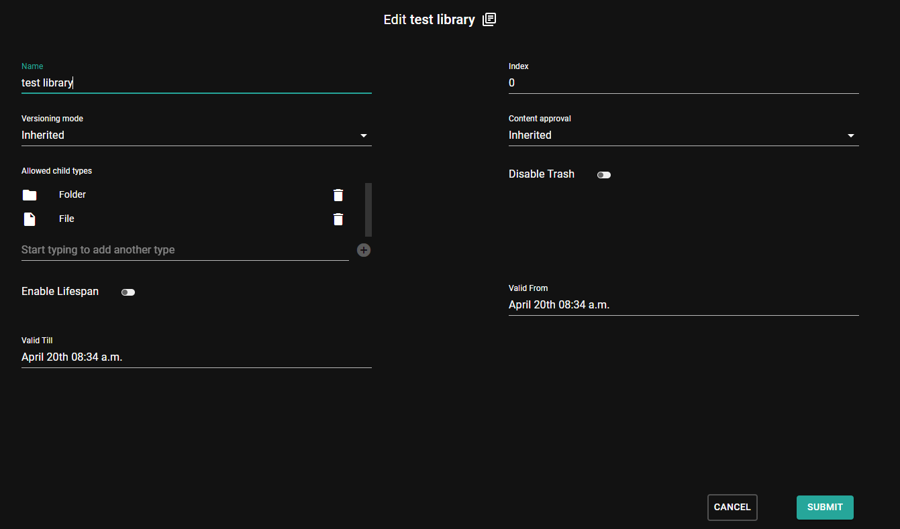
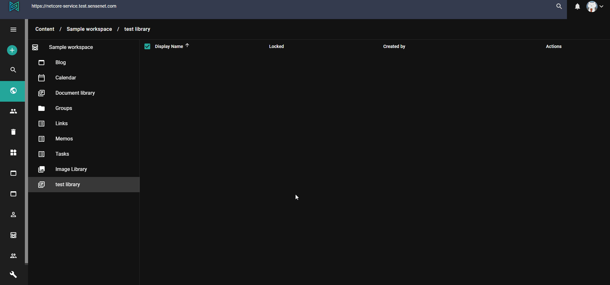
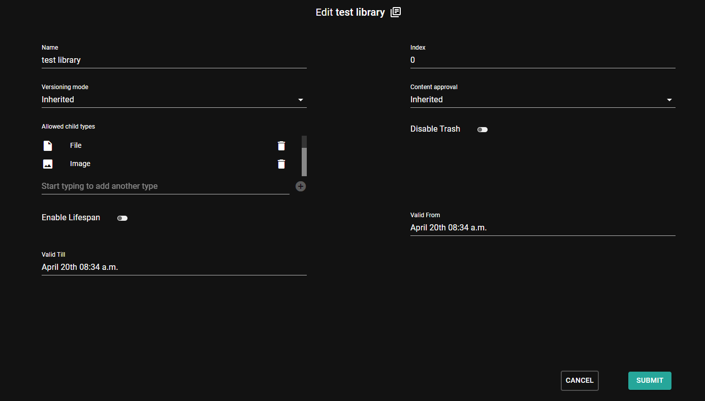
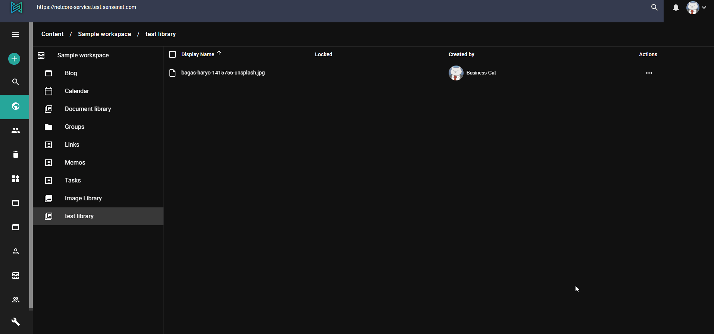
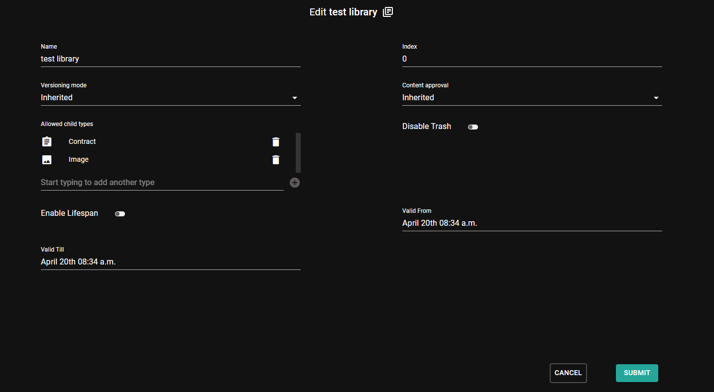
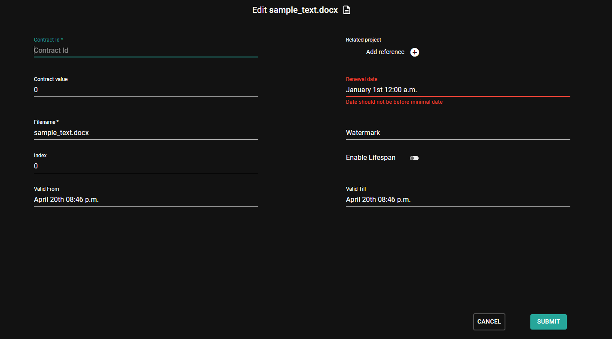

In this tutorial you will learn how you can upload content to a container with a custom type. We will look at how to upload other built-in types like Image or totally custom types that are inherited from the default File.

## Upload basics

By default if you upload a file into a container in sensenet it will be created as a `File`. `File` is the built-in type for storing files in the content repository. This type's key field is a binary field, which contains the actual binary of the file. Learn more about the `File` content type in the [concepts](/concepts/content-types/06-file).

First lets check the default behavior of upload. Create your own document library for playing with the types. If you open your newly created library and start to add content to it, the add new dropdown list by default contains two types (*File* and *Folder*) and *Upload*.



This three things comes from the value of the allowed child types field. The allowed child type list contains the types that can be used to create content in a container. Let's look at the types in the edit view of our library:



As you can see Folder and File types are available which means that if you upload a document it will be created as `File` whether it is an image or a Word document. The upload option is displayed based on if `File` or an inherited type is in the allowed child type list (there is an uploadable type allowed).

<note severity="info">Learn more about allowed child types in the <a href="/concepts/content-management/06-allowed-childtypes">concept docs</a>.</note>

If you now upload an image it will be a simple *File* content in the sensenet repository not a "real" *Image*.



<note severity="info">Pro tip: you can always check the exact type of a content on its edit view. The icon next to the form title is the icon of the type, you can check the name of the related CTD by hovering over the icon and by clicking it you can get to the CTD right away.</note>

## Upload images

How an image can be uploaded with the content type Image? Nothing is simpler, let's add the **Image** type to the allowed child types list next to File and Folder.



Then *Image* becomes available in the add new content dropdown and if you upload an image to the library it will be created with the `Image` type.



## Upload content with a custom type

Let's create a custom type inherited from File with some additional fields for Contracts. Create a new content type definition with the following xml:

```xml
<ContentType name="Contract" parentType="File" handler="SenseNet.ContentRepository.File" xmlns="http://schemas.sensenet.com/SenseNet/ContentRepository/ContentTypeDefinition">
  <DisplayName>Contract</DisplayName>
  <Description>Type for agreement documents</Description>
  <Icon>TaskList</Icon>
  <Fields>
  <Field name="ContractId" type="ShortText">
    <DisplayName>Contract Id</DisplayName>
    <Description>Unique contract Id needed for example for legal proceedings</Description>
    <Configuration>
      <MaxLength>30</MaxLength>
      <MinLength>10</MinLength>
      <Regex>[a-zA-Z0-9]*$</Regex>
      <Compulsory>true</Compulsory>
    </Configuration>
  </Field>
  <Field name="RelatedProject" type="Reference">
    <DisplayName>Related project</DisplayName>
    <Description>Project to which the contract relates</Description>
    <Configuration>
      <AllowMultiple>false</AllowMultiple>
      <AllowedTypes>
        <Type>ProjectWorkspace</Type>
      </AllowedTypes>
    </Configuration>
  </Field>
  <Field name="ContractValue" type="Number">
    <DisplayName>Contract value</DisplayName>
    <Description>Value of the contract</Description>
    <Configuration>
      <Digits>2</Digits>
    </Configuration>
  </Field>
  <Field name="RenewalDate" type="DateTime">
    <DisplayName>Renewal date</DisplayName>
    <Description>The date of renewal of the contract</Description>
  </Field>
  </Fields>
</ContentType>
```

This content type definition will include fields inherited from the File type (*Binary*, *DisplayName*, etc) and custom ones related to contracts as mentioned in the example above (*RelatedProject*, *RenewalDate*, etc).

Open the settings menu and go to Configurations. There you can find a configurations file named Portal.settings. Open it for edit. This json file contains system-wide settings related to extensions and file types. Search for the list of `UploadFileExtensions`, which is actually an array that contains extension and content type pairs. You can define here how the system should handle the different file extensions when you upload a file with a specific one. As you can see, the common image file extensions are listed and connected to the *Image* type and *File* is the default. Add a new key value pair to connect Word documents and your newly created type, *Contract*. This setting means that if you upload a Word document it will be created as Contract and will have the custom fields as well.

```json
...
"UploadFileExtensions": {
    "docx": "Contract",
    "jpg": "Image",
    "jpeg": "Image",
    "gif": "Image",
    "png": "Image",
    "bmp": "Image",
    "svg": "Image",
    "svgz": "Image",
    "tif": "Image",
    "tiff": "Image",
    "xaml": "WorkflowDefinition",
    "DefaultContentType": "File",
  },
...
```

Then go to the library and make Contract an allowed child type (this makes it possible to add Contract contents to it).



After that if you upload a new file with .docx extension it will be uploaded with the Contract type and you can reach the additional fields when you open it for edit.


