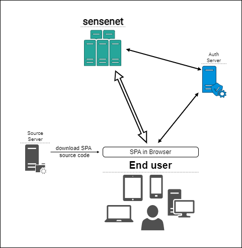
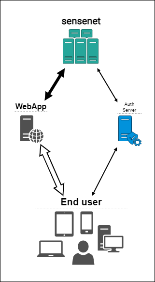

In this article we will show you the recommended application architectures for simple applications built with sensenet. We will cover two kinds of applications:

- single-page applications (SPA)
- server-side Asp.Net applications

In both cases we will treat sensenet as a 'black box': you do not need to know the details of hosting and configuring the sensenet service. You only need to know the url of the service.

> To see a more complex example for an enterprise application built with sensenet, please see the [Advanced application architecture](/tutorials/getting-started/02-advanced-application-architecture) tutorial.

## A single-page application
This is the most common application type nowadays. The business logic is written in _JavaScript_ or _TypeScript_ and the user interface is rendered in the browser. This is the recommended architecture for simple applications built with sensenet.

> In our examples and documentation we use [React](https://react.dev) to create client-side applications, but you can choose any of the well-known frameworks. We recommend React though because we offer a client-side SDK for this platform.
> 
> To learn more about how to work with sensenet and React, read the [Getting started with React](/tutorials/getting-started/getting-started-with-react) tutorial.

### Urls and services
Your single page application (SPA) will be accessible on your domain of choice - e.g. `https://myapp.com`. This is the url that users will type in their browser to access your application. The sensenet repository service will be available at a different url - e.g. `https://myapp.sensenet.cloud`. Your users will not have to know this. This is the url that your client-side application will use to connect to the sensenet service. The sensenet service **has to be available on the internet**, so you can access it from your client-side application.

### What the user sees - rendering the HTML
You can build the user interface using the usual React techniques. We offer a sensenet-specific [component library](https://github.com/SenseNet/sn-client) that you can use to build your application. You can also use any other React component library you like.

See the [Getting started with React](/tutorials/getting-started/getting-started-with-react) tutorial for details.

### Connecting to sensenet
In this case you will send requests from your _client-side_ application directly to the sensenet backend service. No server-side sensenet-specific code is needed - all business logic is implemented on the client.

### Authentication
> If you are working with public content (e.g. a blog or other kinds of public articles) you can skip this section.

Your users will have to log in using their own credentials stored in the sensenet repository (unless you are working with public content of course). For your application this means a simple redirect to the sensenet authentication service, you **do not have to implement a login page**, that comes with sensenet. See the [Authentication from a React client](/tutorials/authentication/how-to-authenticate-react) tutorial to learn more about how to do this.

## A server-side Asp.Net application
In this section we will show you the necessary components of a simple Asp.Net application that uses sensenet as a content repository. This is a common scenario for web applications that need to render HTML pages on the server side.

> We are providing an example for a .Net application because we offer a [client SDK for .Net](/tutorials/getting-started/getting-started-dotnet), but technically you can use any other server-side technology (e.g. _Node.js_) to connect to sensenet. The only requirement is that you need to be able to send _HTTP requests_ to the sensenet backend service.

### Urls and services
Your Asp.Net application will be accessible on your domain of choice - e.g. `https://myapp.com`. This is the url that users will type in their browser to access your application. The sensenet repository service will be available at a different url - e.g. `https://myapp.sensenet.cloud`. This is the url that your Asp.Net application will use to connect to the sensenet service. This service **does not have to be available on the internet**, it can be internal. It is enough if you can access it from your Asp.Net application backend.

### What the user sees - rendering the HTML
There is nothing sensenet-specific about this part, so we will not go into details. You can use your favourite templating engine to render the HTML pages: _Razor Pages_, _MVC_ or anything you like to work with.

### Connecting to sensenet
To connect to sensenet from an Asp.Net application you need to install the [sensenet client package](https://www.nuget.org/packages/SenseNet.Client/) from NuGet. This package contains the client-side SDK that you can use to communicate with sensenet.

This means you will send requests from your _server-side_ application (written in .Net) to the sensenet service. No browser-side sensenet-specific code is needed - except maybe authentication as you'll see later.

Please visit the [Getting started with sensenet and an MVC client](/tutorials/getting-started/getting-started-mvc-client) tutorial to learn more about how to connect to sensenet from an Asp.Net application.

### Authentication
> If you are working with public content (e.g. a blog or other kinds of public articles) you can skip this section.

The authentication solution depends on how do you plan to send backend requests to the sensenet service. There are two options:

- in the name of a dedicated technical user
- in the name of the current user of your application

#### In the name of a technical user
The advantage of this approach is that you don't need to authenticate users on the client (for example because your content is public anyway, e.g. a blog). You can send requests from your Asp.Net app to the sensenet service in the name of a technical user that has the necessary permissions to access the content you need. Or if all your content is public, you do not even have to configure that.

The downside is that you loose the ability of using the sensenet _per-user permission system_, because all backend requests are made in the name of the same technical user.

In this case you have to configure the appropriate credentials in your app configuration. Follow the instruction in the [Authentication from a .Net client](/tutorials/authentication/how-to-authenticate-dotnet) tutorial to learn more about how to do this.

#### In the name of the current user
If you want to display different content items to your users **based on their permissions in sensenet**, you need to **authenticate users on the client**. For example if you want to display private articles only to specific users.

> Of course you can use your own authentication in your application, but here we assume you want to rely on sensenet content permissions.

This means you have to redirect users to the sensenet authentication service which uses the **OAuth2** protocol. 

You can use the [OIDC and OAuth2 client](https://github.com/authts/oidc-client-ts) to handle the authentication process on the client. This is a widely used library that can be used in any client-side application.

After you received the **access token** (Bearer token) from the sensenet authentication service, you can send it to your Asp.Net application. There you can include that token in API calls sent to the sensenet service. This way the sensenet service will be able to identify the user and apply the appropriate permissions.
