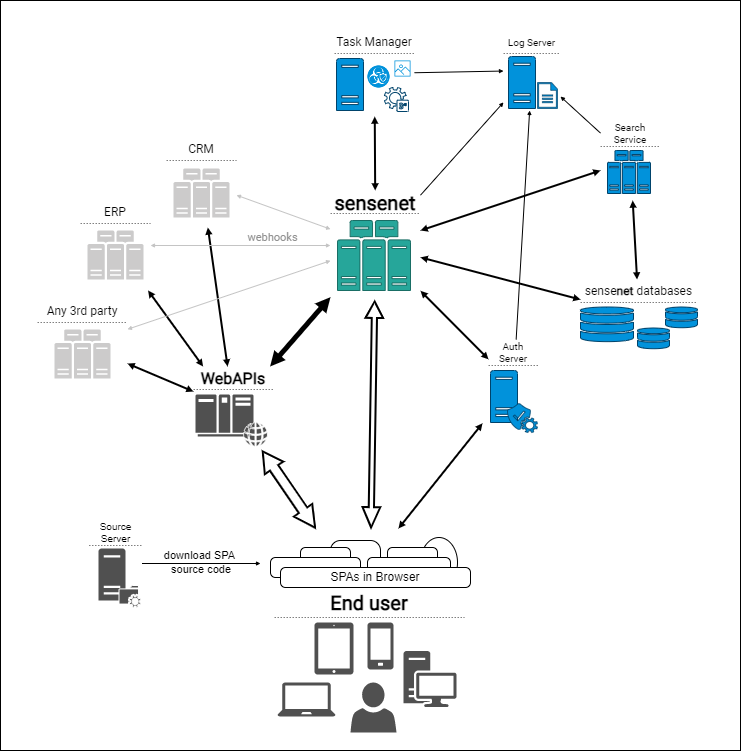

In this article we provide a more complex architecture for advanced applications built with sensenet. This architecture is recommended for applications that have a lot of custom logic and need to be highly scalable.

> Before you start, make sure you have read the [basic application architecture](/tutorials/getting-started/01-basic-application-architecture) article to have an understanding of the components of a simple sensenet application.

As sensenet is a flexible and extensible system, you can build your application in many different ways. The architecture described here is just a recommendation based on our experience with enterprise applications and shows some of the possibilities.

## Main components
The recommended app components are the following:

- **Frontend**: a single-page application (SPA) that runs in the browser.
- **Backend**: a web API that hosts complex business logic and provides data for the frontend and mobile apps.
- **3rd party services**: optional services (ERP, CRM) that can be used to extend the functionality of the application.
- **sensenet components**

## What the user sees - rendering the HTML
A single-page application is the most common application type nowadays. The business logic is written in _JavaScript_ or _TypeScript_ and the user interface is rendered in the browser.

> In our examples and documentation we use [React](https://react.dev) to create client-side applications, but you can choose any of the well-known frameworks. We recommend React though because we offer a client-side SDK for this platform.
> 
> To learn more about how to work with sensenet and React, read the [Getting started with React](/tutorials/getting-started/getting-started-with-react) tutorial.

This frontend application is the **main entry point** of your system and is likely to be hosted on a url like `https://myapp.com`.

### Additional frontend applications
In an enterprise scenario it is likely that you will have more than one frontend application. For example, you may have a mobile app that is used by your employees to access the system. Or you may have a public website that is used by your customers to access their data and a different one for your employees or administrators.

sensenet is able to handle any number of frontend applications. Our OAuth2 authentication service can work with multiple clients and you can leverage single-sign-on (SSO) to provide a seamless experience for your users.

## Backend web API
This is an Asp.Net application written by the app developer. It may be responsible for business logic that cannot be implemented in the frontend, or it can be used to transform data coming from the repository to a format that is easier to use in the frontend.

It is likely that this backend web API will be accessible on a service url like `https://api.myapp.com`.

> We are providing an example for a .Net application because we offer a [client SDK for .Net](/tutorials/getting-started/getting-started-dotnet), but technically you can use any other server-side technology (e.g. _Node.js_) to connect to sensenet. The only requirement is that you need to be able to send _HTTP requests_ to the sensenet backend service.

Please visit the [Getting started with sensenet and an MVC client](/tutorials/getting-started/getting-started-mvc-client) tutorial to learn more about how to connect to sensenet from an Asp.Net application.

## Optional 3rd party services
In an enterprise environment there are always other systems that need to be accessed from a secure backend application. These systems can be ERP, CRM or other systems that are used by the company. These systems can be accessed from the backend web API described above.

sensenet is able to connect to 3rd party systems directly using [webhooks](/concepts/webhooks). This way you can create a **workflow** that is triggered by an event in the repository.

## sensenet components
Although sensenet is a black box for the frontend and backend applications (especially if it is hosted in the cloud), its components are worth mentioning so that you can have an understanding of our internal architecture.

### Repository service
This is the main sensenet service that lets you manage your content stored in the repository. Its REST API is accessible on a url like `https://myapp.sensenet.cloud` (or on a local URL if you choose to host it yourselves).

### Authentication service
sensenet has a separate authentication service to support the _OAuth2_ protocol. This service is responsible for authenticating users and providing access tokens for the repository service.

### Search service
When using sensenet in a load balanced environment (multiple instances of the repository service) you need to use a search service to make sure that the search results are consistent. This service is responsible for managing the index and providing search results for the repository service.

### Database
sensenet uses a relational database to store content. This database is not accessible from the outside, it is only used by the repository service. Optionally there can be other databases in the system, for example a separate database for binaries, permissions or task management.

### Task management
Task management is a powerful service that can handle long-running tasks in the background, separately from the web app. It is used by the repository to generate preview images for example.

### Log server
All sensenet components use a log server to store their log messages. This is a separate service that can be used to monitor the health of the system.