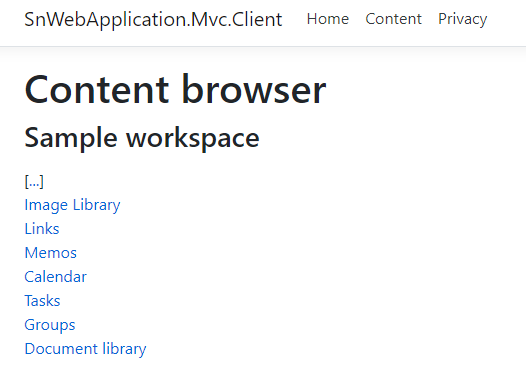
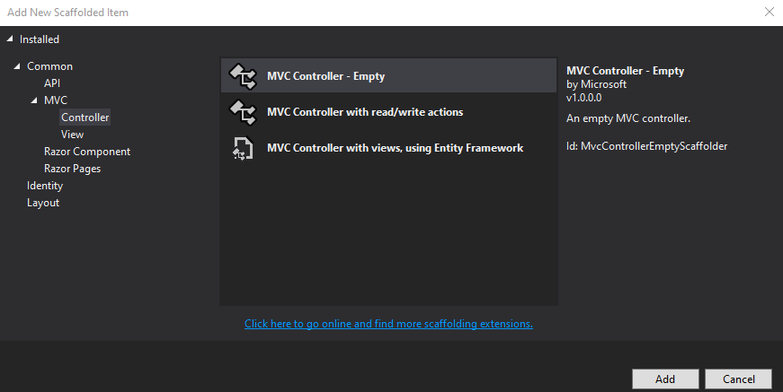

In this tutorial we will build a basic Asp.Net MVC application. This is a server-side application that sends **server-to-server** requests to the sensenet repository from the backend. It will be capable of loading and displaying content items in a regulat MVC controller and view environment.

The application uses the sensenet [.Net client library](/getting-started-dotnet) to connect to the repository. You can use all the APIs offered by that library to manage content items.

> This tutorial does not cover authentication in the MVC application, only admin requests towards sensenet. See details in the Authentication section below.



## Create a new Asp.Net Core Web Application
Create a new Asp.Net Core Web Application either in command line (`dotnet new`), Visual Studio or VS Code. We use MVC views in this tutorial, but the technology works the same way in Razor pages.

Install the following NuGet package:

SenseNet.Client [](https://www.nuget.org/packages/SenseNet.Client)

## Register the token store
In the `ConfigureServices` method of the `Startup` class please register the following service:

```csharp
services.AddSenseNetClientTokenStore();
```

### Authentication
> **Important**: this example does not deal with authenticating the *user* who visits the MVC application. The MVC application authenticates itself towards sensenet using a [client/secret pair](../authentication/how-to-authenticate-dotnet). This means the requests sent to the repository will be performed *in the name of an administrator*.

The token store above is responsible for requesting and caching authentication tokens for a sensenet repository. The token is requested by a client id and a secret. Please see the details in the article above.

## New model class
Create a new model class named `SnContent` in the Models folder. Note that we use `dynamic` here to make property access more convenient.

```csharp
public class SnContent
{
    public dynamic Content { get; set; }
    public IEnumerable<dynamic> Children { get; set; }
}
```

## New controller
Create a new controller named `ContentController`. This is where most of the logic will go.



### Authenticate using the client library
Add a constructor that expects a token store and a helper method that constructs a server object that lets you connect to sensenet.

> Please note that in a real application you would load the values below from configuration.

```csharp
private readonly ITokenStore _tokenStore;

public ContentController(ITokenStore tokenStore)
{
    _tokenStore = tokenStore;
}

private async Task<ServerContext> GetSnServer()
{
    // define sensenet service url
    var server = new ServerContext
    {
        Url = "https://example.sensenet.cloud"
    };

    // request and set the access token
    server.Authentication.AccessToken = await _tokenStore.GetTokenAsync(server,
        "clientid",
        "secret");

    return server;
}
```

### Add an action with business logic
This is the default and only action in this controller. It gets the content defined by the id parameter (or the default workspace root) and loads its children for the view to display (we will create the view in the next section).

```csharp
public async Task<IActionResult> Index(int id = 0)
{
    Content content;

    var server = await GetSnServer();

    if (id == 0)
    {
        // display the root
        content = await SenseNet.Client.Content.LoadAsync("/Root/Content/SampleWorkspace", server);
    }
    else
    {
        // load the current content
        content = await SenseNet.Client.Content.LoadAsync(id, server);
    }

    var children = await SenseNet.Client.Content.LoadCollectionAsync(content.Path, server);
    
    return View(new SnContent
    {
        Content = content,
        Children = children
    });
}
```

## New view
Create a new empty view in the Views/Content folder named `Index`. This will be the default view for the `Content` controller. It lists the child elements of a container and also displays a link to the parent.

```html
@{
    ViewData["Title"] = "Content browser";
}
@using SenseNet.Client
@model SnContent

<h1>Content browser</h1>
<h3>@Model.Content.DisplayName</h3>

<p>
    <div>
        [<a asp-controller="Content" asp-route-id="@Model.Content["ParentId"]">...</a>]
    </div>
    @foreach (var content in Model.Children)
    {
        <div>
            <a asp-controller="Content" asp-route-id="@content.Id">@content.DisplayName</a>
        </div>
    }
</p>
```

## New menu item in the header
Add a link to the header (the shared `_Layout.cshtml` view):

```html
<li class="nav-item">
   <a class="nav-link text-dark" asp-controller="Content" asp-action="Index">Content</a>
</li>
```

You will see a **Content** menu item in the header when you start the application. Clicking on it will display a list of content items as links that you can use to navigate up and down in the content tree.