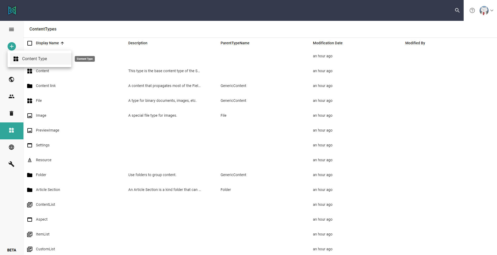
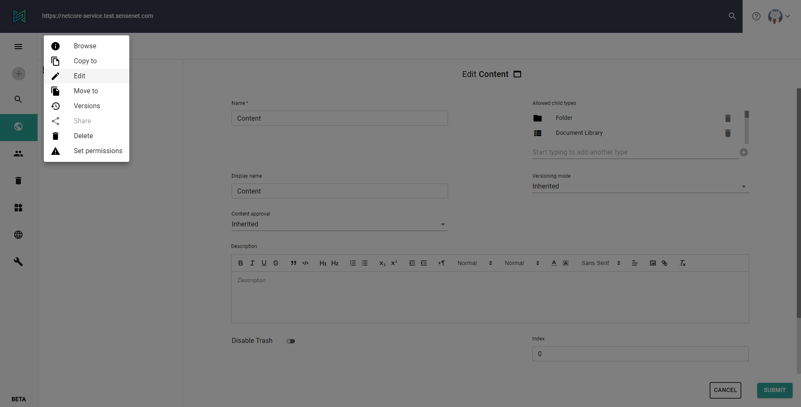
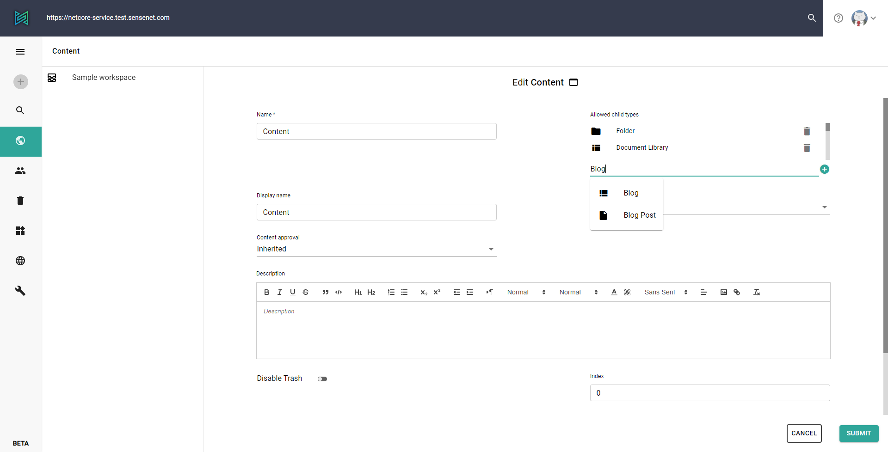
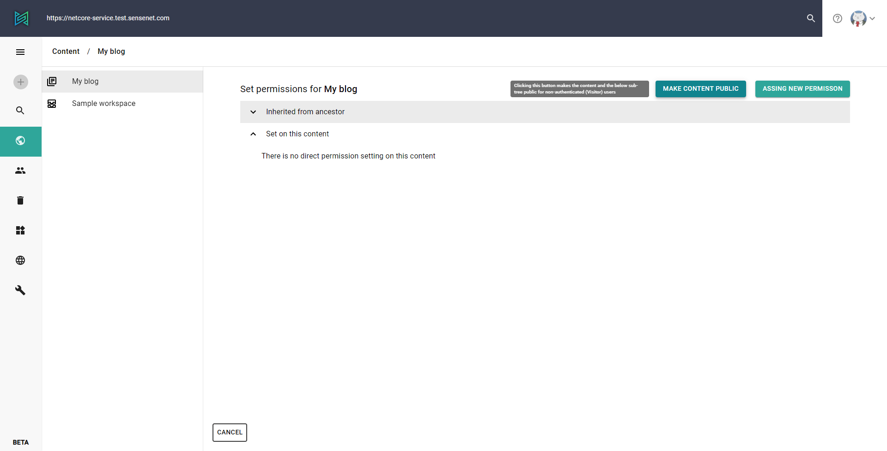

In this tutorial, you will discover how to start a new project using [Next.js](https://nextjs.org/) and sensenet.

## About the technologies

Next.js is a framework for building interactive client applications based on React. It supports server side rendering and static site generation too, feel free to try both techniques with sensenet. You can read more about their advantages [here](https://vercel.com/blog/nextjs-server-side-rendering-vs-static-generation). This guide will use server side rendering, but it is easily convertible to a static site.

As you may have already known sensenet is a [headless CMS](/concepts/introduction/02-what-is-headless-cms) which makes it easy to create applications with your chosen client technologies.

Combining these together you can build applications with customized user interfaces without any need of using or even knowing complex backend programming languages and technologies.

## Build a simple blog

Run the Next.js installation with the following command:

```javascript
npx create-next-app
# or
yarn create next-app
```

It asks the name of your project and creates a basic Next.js application in a new folder.

Now install the sensenet client core package and start your application:

```javascript
npm install --save @sensenet/client-core
npm run dev
# or
yarn add @sensenet/client-core
yarn dev
```

You should see your new application with a greeting to the world on localhost:3000 address in your browser.

## Create content types and blog posts in your sensenet repository

There are several built in content types in sensenet, but in this tutorial we will create custom ones for our needs.

Open the Admin UI [here](https://admin.sensenet.com/). Log in to your sensenet repository and navigate to the content types using the drawer on the left. You should add the following 2 [CTDs](/concepts/content-management/03-content-types) (Content Type Definition) with clicking on the + plus button and selecting Content Type.



It opens a new page with and editor. Replace the default text inside the editor to the code of our types.

**Blog** will be the container of our posts and it is descendant of the built in **ContentList** type. You can define more fields if you would like to add some introduction or description to your blog.

```xml
<ContentType name="Blog" parentType="ContentList" handler="SenseNet.ContentRepository.ContentList" xmlns="http://schemas.sensenet.com/SenseNet/ContentRepository/ContentTypeDefinition">
  <DisplayName>Blog</DisplayName>
  <Description>Container of blog posts</Description>
  <Icon>ContentList</Icon>
  <AllowedChildTypes>
    BlogPost
  </AllowedChildTypes>
  <Fields></Fields>
</ContentType>
```

**Post** is descendant of **Article** type which contains basic fields for metadata, e.g. author, lead, keywords or content body. We will extend it with the date of publication.

```xml
<ContentType name="BlogPost" parentType="Article" handler="SenseNet.ContentRepository.GenericContent" xmlns="http://schemas.sensenet.com/SenseNet/ContentRepository/ContentTypeDefinition">
  <DisplayName>Blog Post</DisplayName>
  <Icon>Document</Icon>
  <AllowIncrementalNaming>true</AllowIncrementalNaming>
  <Fields>
      <Field name="Date" type="DateTime">
      <DisplayName>Publish date</DisplayName>
      <Configuration>
        <DateTimeMode>Date</DateTimeMode>
      </Configuration>
    </Field>
  </Fields>
</ContentType>
```

These are basic types for our blog. Feel free to try add more fields or modify their configuration.

## Create posts

In the previous chapter we have added new types, so now we are able to fill our blog with content.

- Navigate to the content explorer by clicking on the globe icon on the drawer.

- First we should add our new Blog type to the [allowed child types](/concepts/content-management/06-allowed-childtypes) on the explorer to be able to create a new Blog content. Right click on the Content item on the breadcrumb and edit it:



- Add our Blog type to the allowed child types field. Do not forget to click on the + icon beside the input and save the form.

- The dropdown of the add (+) button in the drawer should contain a Blog item, click on it. Create a new item with MyBlog name by filling out the form.



- Navigate inside the new blog content and add at least 2 items with Blog Post type.

## Make our blog public

We would like to create a public blog site without authentication, so we have to make our posts accessible by anyone:

- Right click on the Blog content and choose the Set permissions options.

- The upcoming surface contains the [permission settings](/guides/roles-and-permissions/permission-editor) of the content. It has a 'Make content public' button, click on it.



- That's it. Now you can access the blog's data through our API without authentication.

## Let's start coding.

Create a new file named as index.js in the pages/api folder in your next.js application with the following code:

### API index.js

```javascript
import { Repository } from "@sensenet/client-core";

export const repository = new Repository(
  { repositoryUrl: "https://netcore-service.test.sensenet.com/" },
  fetch
);
```

We created our repository instance, which contains a lot of useful methods to execute operations on the sensenet repository. We should have only one repository instance at a time in our application.

At last, create the routing for our blog and fetch the data from the API. Create a new blog folder inside the pages folder, and create the following two files inside:

### Blog index.js

```tsx
import React from "react";
import { repository } from "../api";
import Link from "next/link";

const Blog = ({ posts }) => {
  return (
    <>
      <h1>My new blog</h1>

      {!posts?.length ? (
        <p>No posts.</p>
      ) : (
        <ul>
          {posts.map((post) => (
            <li key={post.Id}>
              <Link href="/blog/[post]" as={`blog/${post.Name}`}>
                <a>{post.DisplayName}</a>
              </Link>
            </li>
          ))}
        </ul>
      )}
    </>
  );
};

export const getServerSideProps = async () => {
  try {
    const posts = await repository.loadCollection({
      path: "/Root/Content/MyBlog",
    });

    return { props: { posts: posts.d.results } };
  } catch (error) {
    return { props: { posts: null } };
  }
};

export default Blog;
```

The `loadCollection` function is querying the children of our Blog from the API. You can modify the result set with filtering, sorting and a lot more, you can see more information in the documentation.

### post.js

```tsx
import React from "react";
import { repository } from "../api";

const BlogPost = ({ post }) => {
  return post ? (
    <article>
      <h1>{post.DisplayName}</h1>
      <section>
        <p>Author: {post.Author}</p>
        <p>Publish date: {post.Date}</p>
      </section>
      <section dangerouslySetInnerHTML={{ __html: post.Body }} />
    </article>
  ) : (
    <>
      <h1>404</h1>
      <p>Post not found.</p>
    </>
  );
};

export const getServerSideProps = async (context) => {
  try {
    const res = await repository.load({
      idOrPath: `/Root/Content/MyBlog/${context.params.post}`,
      oDataOptions: { select: "all" },
    });

    return { props: { post: res.d } };
  } catch (error) {
    return { props: { post: null } };
  }
};

export default BlogPost;
```

The `load` function is querying a content's data from the API.

Open your site at [localhost](http://localhost:3000/blog) and you can see your new basic blog. Customize it and display more details as you like.

Congratulation! You have created your first Next.js application over sensenet.
